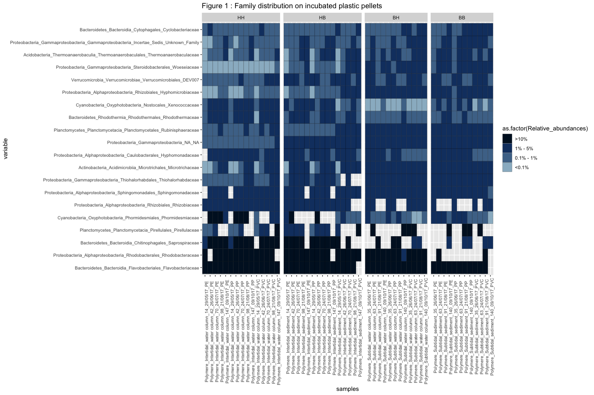

Plastisphere\_Q1
================

#### Question 1 : Differences in bacterial communities between plastic and seawater

    1. Alpha-diversity
    2. Families enriched in seawater vs plastics

### Prepare tables

## 1\. Alpha-diversity

### Alpha-diversity seawater / polymers

``` r
library(phyloseq)
library(reshape2)
library(ggplot2)

Phymatrice <- readRDS("Metaplastics_phyloseq.rds")
nsamp <- nsamples(Phymatrice)

# Calculate richness
richness <- matrix(nrow = nsamp, ncol = 1)
row.names(richness) <- sample_names(Phymatrice)
rich <- as.numeric(as.matrix(estimate_richness(Phymatrice, measures = "Observed")))
richness[ ,1] <- rich

# Calculate evenness
evenness <- matrix(nrow = nsamp, ncol = 1)
row.names(evenness) <- sample_names(Phymatrice)
even <- as.numeric(as.matrix(estimate_richness(Phymatrice, measures = "InvSimpson")))
evenness[ ,1] <- even

# Calculate Shannon
Shannon <- matrix(nrow = nsamp, ncol = 1)
row.names(Shannon) <- sample_names(Phymatrice)
Shan <- as.numeric(as.matrix(estimate_richness(Phymatrice, measures = "Shannon")))
Shannon[ ,1] <- Shan

# Calculate Simpson
Simpson <- matrix(nrow = nsamp, ncol = 1)
row.names(Simpson) <- sample_names(Phymatrice)
Simp <- as.numeric(as.matrix(estimate_richness(Phymatrice, measures = "Simpson")))
Simpson[ ,1] <- Simp


#Merge all index in a table
alpha <- cbind(richness, evenness, Shannon, Simpson)

# export the table
write.table(alpha, "Plastic_alpha.txt", sep="\t")

alpha <- read.table("Plastic_alpha.txt", header=T, row.names=1)
alpha <- as.data.frame(alpha)
colnames(alpha) <- c("Observed", "invSimpson", "Shannon","Simpson")
alpha <- alpha[order(row.names(alpha)),]

metadata <- metadata[rownames(metadata) %in% rownames(alpha),]
alpha <- alpha[rownames(alpha) %in% rownames(metadata),]

meta <- subset(metadata, Dataset == "microrevenge")
meta <- subset(meta, Type_sample == "sample")
alpha <- alpha[rownames(alpha) %in% rownames(meta),]


alpha$Position <- meta$Position_estran
alpha$Filter_size <- meta$Filter_size

df <- cbind(samples = rownames(alpha), alpha)
df_m <- melt(df, id.vars=c("samples", "Filter_size", "Position"))

p1 <- ggplot(data=df_m, aes(x=Filter_size, y=value)) +
  geom_boxplot() +
  #geom_point() +
  #scale_colour_manual(values=c("#002e63","#417dc1","#990000","#d73b3e")) +
  facet_grid(variable~., scales="free",space="free_x") + ggtitle("Alpha diversity") +
  guides(fill=FALSE)
```


Alpha diversity (ASV richness and eveness) increases with the filter
size of seawater. Alpha-diversity of bacterial communities associated to
plastic pellets is closer to the one found for the larger attached
fractions of seawater (5-60µm and over 60µm)

### Alpha-diversity seawater only

``` r
alpha <- read.table("Plastic_alpha.txt", header=T, row.names=1)
alpha <- as.data.frame(alpha)
colnames(alpha) <- c("Observed", "invSimpson", "Shannon","Simpson")
alpha <- alpha[order(row.names(alpha)),]

alpha <- alpha[rownames(alpha) %in% rownames(meta),]

alpha$Filter_size <- meta$Filter_size
alpha$Date <- meta$Date_collecte

df <- cbind(samples = rownames(alpha), alpha)
df_m <- melt(df, id.vars=c("samples", "Filter_size", "Date"))

p2 <- ggplot(data=df_m, aes(x=Date, y=value, colour=Filter_size)) +
  geom_point() +
  facet_grid(variable~Date, scales="free",space="free_x") + ggtitle("Alpha diversity") +
  guides(fill=FALSE)
```


## 2\. Taxa enriched in plastics vs seawater

### Taxa enriched in plastics vs 0.2µm

``` r
# Using DESeq2 package

library(DESeq2)
library(phyloseq)
library(ggplot2)
library(reshape2)
library(RColorBrewer)

otu <- read.table("OTU_table_family.txt", header=T, row.names=1, sep="\t")
colnames(otu) <- gsub('X','', colnames(otu))

meta <- subset(metadata, Dataset == "microrevenge")
meta <- subset(meta, Type_sample == "sample")
meta <- subset(meta, Filter_size=="polymere" | Filter_size =="0.2")
otu <- otu[,colnames(otu) %in% rownames(meta)]
otu <- otu[apply(otu[,], 1, function(x) !all(x==0)),]

OTU <- otu_table(otu, taxa_are_rows = T)

META <- sample_data(meta)

Phymatrice <- phyloseq(OTU, META)


#Convert into deseq object
deseq = phyloseq_to_deseq2(Phymatrice, ~ Matrice)

# Remove the least abundant OTUs (less than 100 sequences over all the samples)
keep <- rowSums(counts(deseq)) >= 100
deseq <- deseq[keep,]

# perform DESeq
deseq$Matrice <- factor(deseq$Matrice, levels = c("Seawater","Polymere"))
deseq <- DESeq(deseq)

res <- results(deseq, alpha=0.1)
summary(res)
```

    ## 
    ## out of 378 with nonzero total read count
    ## adjusted p-value < 0.1
    ## LFC > 0 (up)       : 81, 21%
    ## LFC < 0 (down)     : 68, 18%
    ## outliers [1]       : 4, 1.1%
    ## low counts [2]     : 88, 23%
    ## (mean count < 2)
    ## [1] see 'cooksCutoff' argument of ?results
    ## [2] see 'independentFiltering' argument of ?results

``` r
# Filter the family based on padj and Log2FoldChange
resSub <- subset(res, padj < 0.01)
resSub <- subset(resSub, log2FoldChange > 2 | log2FoldChange < -2)
resSub <- subset(resSub, baseMean > 50)

Sub.02 <- as.data.frame(resSub)

Sub.02 <- cbind(taxa = rownames(Sub.02), Sub.02)
Sub.02 <- Sub.02[order(Sub.02$log2FoldChange, decreasing=F),]
levels <- Sub.02$taxa
Sub.02$taxa <- factor(Sub.02$taxa, levels=levels)
```

### Taxa enriched in plastics vs 1µm

``` r
# Using DESeq2 package

library(DESeq2)
library(phyloseq)
library(ggplot2)
library(reshape2)
library(RColorBrewer)


otu <- read.table("OTU_table_family.txt", header=T, row.names=1, sep="\t")
colnames(otu) <- gsub('X','', colnames(otu))

meta <- subset(metadata, Dataset == "microrevenge")
meta <- subset(meta, Type_sample == "sample")
meta <- subset(meta, Filter_size=="polymere" | Filter_size =="1")
otu <- otu[,colnames(otu) %in% rownames(meta)]
otu <- otu[apply(otu[,], 1, function(x) !all(x==0)),]

OTU <- otu_table(otu, taxa_are_rows = T)

META <- sample_data(meta)

Phymatrice <- phyloseq(OTU, META)

#Convert into deseq object
deseq = phyloseq_to_deseq2(Phymatrice, ~ Matrice)

# Remove the least abundant OTUs (less than 100 sequences over all the samples)
keep <- rowSums(counts(deseq)) >= 100
deseq <- deseq[keep,]

# perform DESeq
deseq$Matrice <- factor(deseq$Matrice, levels = c("Seawater","Polymere"))
deseq <- DESeq(deseq)

res <- results(deseq, alpha=0.1)
summary(res)
```

    ## 
    ## out of 377 with nonzero total read count
    ## adjusted p-value < 0.1
    ## LFC > 0 (up)       : 56, 15%
    ## LFC < 0 (down)     : 77, 20%
    ## outliers [1]       : 2, 0.53%
    ## low counts [2]     : 30, 8%
    ## (mean count < 1)
    ## [1] see 'cooksCutoff' argument of ?results
    ## [2] see 'independentFiltering' argument of ?results

``` r
# Filter the family based on padj and Log2FoldChange
resSub <- subset(res, padj < 0.01)
resSub <- subset(resSub, log2FoldChange > 2 | log2FoldChange < -2)
resSub <- subset(resSub, baseMean > 50)

Sub.1 <- as.data.frame(resSub)

Sub.1 <- cbind(taxa = rownames(Sub.1), Sub.1)
Sub.1 <- Sub.1[order(Sub.1$log2FoldChange, decreasing=F),]
levels <- Sub.1$taxa
Sub.1$taxa <- factor(Sub.1$taxa, levels=levels)
```

### Taxa enriched in plastics vs 5µm

``` r
# Using DESeq2 package

library(DESeq2)
library(phyloseq)
library(ggplot2)
library(reshape2)
library(RColorBrewer)


otu <- read.table("OTU_table_family.txt", header=T, row.names=1, sep="\t")
colnames(otu) <- gsub('X','', colnames(otu))

meta <- subset(metadata, Dataset == "microrevenge")
meta <- subset(meta, Type_sample == "sample")
meta <- subset(meta, Filter_size=="polymere" | Filter_size =="5")
otu <- otu[,colnames(otu) %in% rownames(meta)]
otu <- otu[apply(otu[,], 1, function(x) !all(x==0)),]

OTU <- otu_table(otu, taxa_are_rows = T)

META <- sample_data(meta)

Phymatrice <- phyloseq(OTU, META)

#Convert into deseq object
deseq = phyloseq_to_deseq2(Phymatrice, ~ Matrice)

# Remove the least abundant OTUs (less than 100 sequences over all the samples)
keep <- rowSums(counts(deseq)) >= 100
deseq <- deseq[keep,]

# perform DESeq
deseq$Matrice <- factor(deseq$Matrice, levels = c("Seawater","Polymere"))
deseq <- DESeq(deseq)

res <- results(deseq, alpha=0.1)
summary(res)
```

    ## 
    ## out of 386 with nonzero total read count
    ## adjusted p-value < 0.1
    ## LFC > 0 (up)       : 46, 12%
    ## LFC < 0 (down)     : 67, 17%
    ## outliers [1]       : 7, 1.8%
    ## low counts [2]     : 43, 11%
    ## (mean count < 1)
    ## [1] see 'cooksCutoff' argument of ?results
    ## [2] see 'independentFiltering' argument of ?results

``` r
# Filter the family based on padj and Log2FoldChange
resSub <- subset(res, padj < 0.01)
resSub <- subset(resSub, log2FoldChange > 2 | log2FoldChange < -2)
resSub <- subset(resSub, baseMean > 50)

Sub.5 <- as.data.frame(resSub)

Sub.5 <- cbind(taxa = rownames(Sub.5), Sub.5)
Sub.5 <- Sub.5[order(Sub.5$log2FoldChange, decreasing=F),]
levels <- Sub.5$taxa
Sub.5$taxa <- factor(Sub.5$taxa, levels=levels)
```

### Taxa enriched in plastics vs 60µm

``` r
# Using DESeq2 package

library(DESeq2)
library(phyloseq)
library(ggplot2)
library(reshape2)
library(RColorBrewer)


otu <- read.table("OTU_table_family.txt", header=T, row.names=1, sep="\t")
colnames(otu) <- gsub('X','', colnames(otu))

meta <- subset(metadata, Dataset == "microrevenge")
meta <- subset(meta, Type_sample == "sample")
meta <- subset(meta, Filter_size=="polymere" | Filter_size =="60")
otu <- otu[,colnames(otu) %in% rownames(meta)]
otu <- otu[apply(otu[,], 1, function(x) !all(x==0)),]

OTU <- otu_table(otu, taxa_are_rows = T)

META <- sample_data(meta)

Phymatrice <- phyloseq(OTU, META)

#Convert into deseq object
deseq = phyloseq_to_deseq2(Phymatrice, ~ Matrice)

# Remove the least abundant OTUs (less than 100 sequences over all the samples)
keep <- rowSums(counts(deseq)) >= 100
deseq <- deseq[keep,]

# perform DESeq
deseq$Matrice <- factor(deseq$Matrice, levels = c("Seawater","Polymere"))
deseq <- DESeq(deseq)

res <- results(deseq, alpha=0.1)
summary(res)
```

    ## 
    ## out of 384 with nonzero total read count
    ## adjusted p-value < 0.1
    ## LFC > 0 (up)       : 29, 7.6%
    ## LFC < 0 (down)     : 55, 14%
    ## outliers [1]       : 7, 1.8%
    ## low counts [2]     : 72, 19%
    ## (mean count < 1)
    ## [1] see 'cooksCutoff' argument of ?results
    ## [2] see 'independentFiltering' argument of ?results

``` r
# Filter the family based on padj and Log2FoldChange
resSub <- subset(res, padj < 0.01)
resSub <- subset(resSub, log2FoldChange > 2 | log2FoldChange < -2)
resSub <- subset(resSub, baseMean > 50)

Sub.60 <- as.data.frame(resSub)

Sub.60 <- cbind(taxa = rownames(Sub.60), Sub.60)
Sub.60 <- Sub.60[order(Sub.60$log2FoldChange, decreasing=F),]
levels <- Sub.60$taxa
Sub.60$taxa <- factor(Sub.60$taxa, levels=levels)
```

### Combine biomarkers in a single plot

``` r
Sub.02 <- Sub.02[,c(1,3)]
colnames(Sub.02) <- c("taxa","Log2FoldChange.02")
Sub.1 <- Sub.1[,c(1,3)]
colnames(Sub.1) <- c("taxa","Log2FoldChange.1")
Sub.5 <- Sub.5[,c(1,3)]
colnames(Sub.5) <- c("taxa","Log2FoldChange.5")
Sub.60 <- Sub.60[,c(1,3)]
colnames(Sub.60) <- c("taxa","Log2FoldChange.60")


Sub.1m <- merge(Sub.02, Sub.1, by="taxa", all=T)
Sub.2 <- merge(Sub.1m, Sub.5, by="taxa", all=T)
Sub.3 <- merge(Sub.2, Sub.60, by="taxa", all=T)

Sub <- Sub.3

Sub <- Sub[order(Sub$Log2FoldChange.02, decreasing=T),]
taxtable <- subset(taxtable, taxa != "NA_NA_NA_NA")
Sub$Genus = taxtable[match(Sub$taxa, taxtable$taxa),"Phylum"]
Sub$Family = taxtable[match(Sub$taxa, taxtable$taxa),"taxa"]
levels <- as.factor(Sub$Family)

col.pal <- brewer.pal(8, "Set1")
col.pal = colorRampPalette(col.pal)(16)

Sub_m <- melt(Sub, id.vars=c("taxa","Genus","Family"))

Sub_m <- na.omit(Sub_m)

gg <- ggplot(Sub_m, aes(x=factor(Family, levels=unique(levels)), y = value, fill=Genus)) + 
  geom_bar(stat = "identity", position = "dodge") +
  theme(strip.text.y = element_text(size = 8, angle = 0), axis.text.x = element_text(size = 8 , angle = 90), axis.text.y = element_text(size = 7), legend.position="right") +
  coord_flip() +
  labs(title="DESeq2 biomarkers between polymers and different seawater size fraction",
        x ="Family", y = "Log2FoldChange") +
  facet_grid(.~variable, scales="free", space="free_x") +
  scale_fill_manual(values= col.pal) +
  scale_y_continuous(limits = c(-15,25), breaks=c(-15,-10,-5,0,5,10,15,20,25)) 
```


### Distribution of the main bacterial families colonizing plastic pellets

``` r
# Create a family percent table

OTU <- read.table("DADA2_Plastic_OTU_percent.txt", header=T, row.names=1)
colnames(OTU) <- gsub('X','', colnames(OTU))
metadata <- read.csv("metadata_Meta_plastic.csv", header=T, row.names=1, sep=";")
metadata <- metadata[ order(row.names(metadata)), ]
OTU_subset <- OTU[,colnames(OTU) %in% rownames(metadata)]
OTU_subset <- OTU_subset[apply(OTU_subset[,], 1, function(x) !all(x==0)),]
OTU_subset <- as.data.frame(t(OTU_subset))
OTU_subset <- OTU_subset[ order(row.names(OTU_subset)), ]
meta <- meta[ order(row.names(meta)), ]
taxtable <- read.table("DADA2_Plastic_OTU_tax.txt", header=T, row.names=1, sep="\t")
taxtable <- as.data.frame(taxtable)
taxtable$taxa <- paste(taxtable$Phylum,taxtable$Class,taxtable$Order, taxtable$Family, sep="_")
OTU_t <- as.data.frame(t(OTU_subset))
OTU_t$Family = taxtable[match(rownames(OTU_t), rownames(taxtable)),"taxa"]
df <- cbind(OTUs = rownames(OTU_t), OTU_t)
df_m <- melt(df, id.vars=c("OTUs", "Family"))
mcast <- dcast(df_m, Family ~ variable, sum)
mcast <- na.omit(mcast)
rownames(mcast) <- mcast$Family
mcast <- mcast[,-1]
otu.perc <- as.data.frame(t(mcast))
otu <- t(otu.perc)

write.table(otu, "OTU_percent_family.txt", sep="\t")

# Make the mean of the triplicates by condition

OTU <- read.table("OTU_percent_family.txt", header=T, row.names=1)
colnames(OTU) <- gsub('X','', colnames(OTU))
metadata <- read.csv("metadata_Meta_plastic.csv", header=T, row.names=1, sep=";")
metadata <- metadata[ order(row.names(metadata)), ]
metadata$meta <- paste(metadata$Filter_size, metadata$Position_estran, metadata$Jour_.incubation,  sep="_")
meta <- subset(metadata, Dataset == "microrevenge")
meta <- subset(meta, Type_sample == "sample")
meta <- subset(meta, Matrice == "Polymere")
meta <- subset(meta, type_incubation == "longue")
OTU_subset <- OTU[,colnames(OTU) %in% rownames(meta)]
OTU_subset <- OTU_subset[apply(OTU_subset[,], 1, function(x) !all(x==0)),]
OTU_subset <- as.data.frame(t(OTU_subset))
OTU_subset <- OTU_subset[ order(row.names(OTU_subset)), ]
meta <- meta[ order(row.names(meta)), ]
meta$condition <- paste(meta$Matrice, meta$Zone, meta$Emplacement, meta$Jour_.incubation, meta$Date_collecte, meta$Polymere_type, sep="_")
OTU_subset$condition = meta[match(rownames(OTU_subset), rownames(meta)),"condition"]
OTU_subset <- cbind(samples = rownames(OTU_subset), OTU_subset) 

df_m <- melt(OTU_subset, id.vars=c("samples", "condition"))
mcast <- dcast(df_m, condition ~ variable, mean)
rownames(mcast) <- mcast$condition
mcast <- mcast[,-1]
otu.perc <- as.data.frame(t(mcast))


# Keep the 20 most abundant families in the dataset

otu.perc$tot <- rowSums(otu.perc)
otu.perc <- otu.perc[order(otu.perc$tot, decreasing=T),]
otu.perc <- otu.perc[c(1:20),-61]
families <- factor(rownames(otu.perc), levels = rownames(otu.perc))
OTU <- as.data.frame(t(otu.perc))
df <- cbind(samples = rownames(OTU), OTU)
df$Temps_incubation = meta[match(df$sample, meta$condition),"Jour_.incubation"]
df$Zone = meta[match(df$sample, meta$condition),"Position_estran"]
df$pol= meta[match(df$sample, meta$condition),"Polymere_type"]

df_m <- melt(df, id.vars=c("samples","Temps_incubation","Zone","pol"))

test <- as.data.frame(df_m)

df_m[df_m$value >= 10, "Relative_abundances"] <- ">10%"
df_m[df_m$value >= 5 & df_m$df_m < 10, "Relative_abundances"] <- "5% - 10%"
df_m[df_m$value >= 1 & df_m$value < 5, "Relative_abundances"] <- "1% - 5%"
df_m[df_m$value >= 0.1 & df_m$value < 1, "Relative_abundances"] <- "0.1% - 1%"
df_m[df_m$value < 0.1, "Relative_abundances"] <- "<0.1%"

df_m <- na.omit(df_m)

df_m$samples <- factor(df_m$samples, levels=c("Polymere_Intertidal_water column_14_29/05/17_PE","Polymere_Intertidal_water column_42_26/06/17_PE","Polymere_Intertidal_water column_56_09/10/17_PE","Polymere_Intertidal_water column_70_24/07/17_PE","Polymere_Intertidal_water column_98_21/08/17_PE","Polymere_Intertidal_water column_147_09/10/17_PE","Polymere_Intertidal_water column_14_29/05/17_PP","Polymere_Intertidal_water column_42_26/06/17_PP","Polymere_Intertidal_water column_56_09/10/17_PP","Polymere_Intertidal_water column_70_24/07/17_PP","Polymere_Intertidal_water column_98_21/08/17_PP","Polymere_Intertidal_water column_147_09/10/17_PP","Polymere_Intertidal_water column_14_29/05/17_PVC","Polymere_Intertidal_water column_42_26/06/17_PVC","Polymere_Intertidal_water column_56_09/10/17_PVC","Polymere_Intertidal_water column_70_24/07/17_PVC","Polymere_Intertidal_water column_98_21/08/17_PVC","Polymere_Intertidal_water column_147_09/10/17_PVC",      "Polymere_Intertidal_sediment_14_29/05/17_PE","Polymere_Intertidal_sediment_42_26/06/17_PE","Polymere_Intertidal_sediment_56_09/10/17_PE","Polymere_Intertidal_sediment_70_24/07/17_PE","Polymere_Intertidal_sediment_98_21/08/17_PE","Polymere_Intertidal_sediment_147_09/10/17_PE","Polymere_Intertidal_sediment_14_29/05/17_PP","Polymere_Intertidal_sediment_42_26/06/17_PP","Polymere_Intertidal_sediment_56_09/10/17_PP","Polymere_Intertidal_sediment_70_24/07/17_PP","Polymere_Intertidal_sediment_98_21/08/17_PP","Polymere_Intertidal_sediment_147_09/10/17_PP","Polymere_Intertidal_sediment_14_29/05/17_PVC","Polymere_Intertidal_sediment_42_26/06/17_PVC","Polymere_Intertidal_sediment_56_09/10/17_PVC","Polymere_Intertidal_sediment_70_24/07/17_PVC","Polymere_Intertidal_sediment_98_21/08/17_PVC","Polymere_Intertidal_sediment_147_09/10/17_PVC","Polymere_Subtidal_water column_35_26/06/17_PE","Polymere_Subtidal_water column_63_24/07/17_PE","Polymere_Subtidal_water column_91_21/08/17_PE","Polymere_Subtidal_water column_140_09/10/17_PE","Polymere_Subtidal_water column_35_26/06/17_PP","Polymere_Subtidal_water column_63_24/07/17_PP","Polymere_Subtidal_water column_91_21/08/17_PP","Polymere_Subtidal_water column_140_09/10/17_PP","Polymere_Subtidal_water column_35_26/06/17_PVC","Polymere_Subtidal_water column_63_24/07/17_PVC","Polymere_Subtidal_water column_91_21/08/17_PVC","Polymere_Subtidal_water column_140_09/10/17_PVC","Polymere_Subtidal_sediment_35_26/06/17_PE","Polymere_Subtidal_sediment_63_24/07/17_PE","Polymere_Subtidal_sediment_91_21/08/17_PE","Polymere_Subtidal_sediment_140_09/10/17_PE","Polymere_Subtidal_sediment_35_26/06/17_PP","Polymere_Subtidal_sediment_63_24/07/17_PP","Polymere_Subtidal_sediment_91_21/08/17_PP","Polymere_Subtidal_sediment_140_09/10/17_PP","Polymere_Subtidal_sediment_35_26/06/17_PVC","Polymere_Subtidal_sediment_63_24/07/17_PVC","Polymere_Subtidal_sediment_91_21/08/17_PVC","Polymere_Subtidal_sediment_140_09/10/17_PVC"))

df_m$Relative_abundances <- factor(df_m$Relative_abundances, levels=c(">10%","5% - 10%","1% - 5%","0.1% - 1%","<0.1%"))

df_m$Zone <- factor(df_m$Zone, levels=c("HH","HB","BH","BB"))
families <- levels(families)

gg <- ggplot(df_m, aes(samples, variable, fill= as.factor(Relative_abundances))) +
  geom_tile(color="black")+
  ggtitle("Figure 1 : Family distribution on incubated plastic pellets") +
  scale_fill_manual(values=c("#001329","#133f70","#4d7397","#9ab9cb","#eaeef2")) +
  theme(strip.text.y = element_text(size = 10, angle = 0), axis.text.x = element_text(size = 8 , angle = 90), axis.text.y = element_text(size = 8)) +
  facet_grid(.~Zone, scales="free", space="free_x")
```


