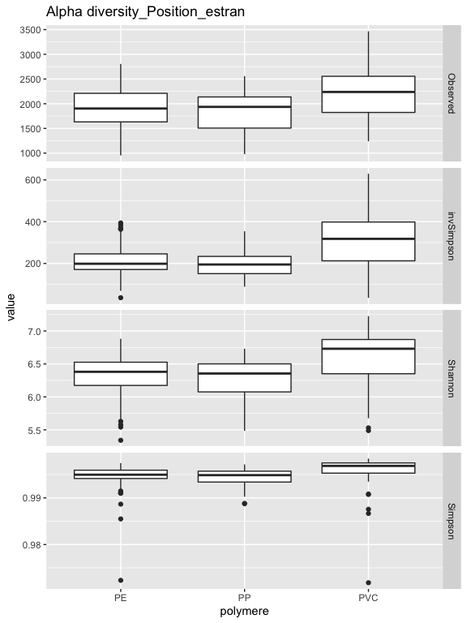
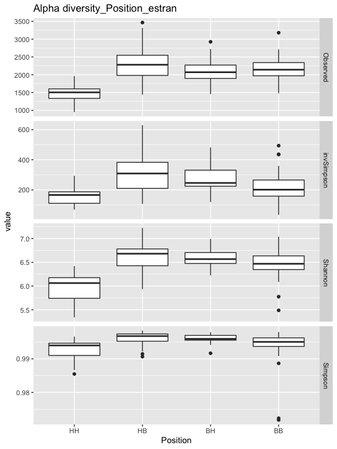
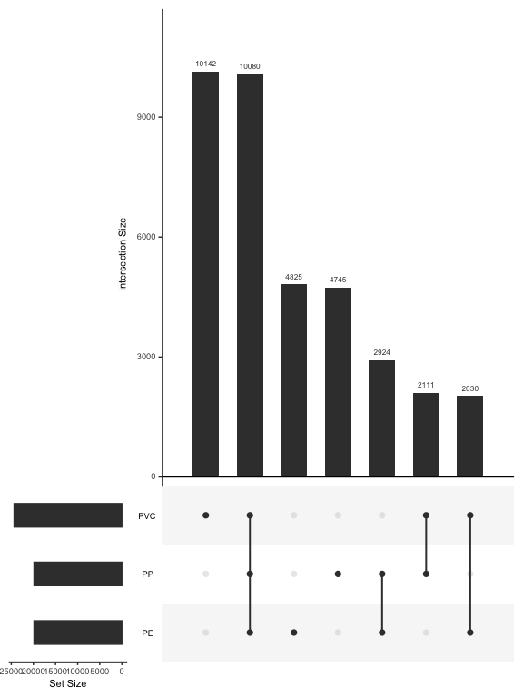
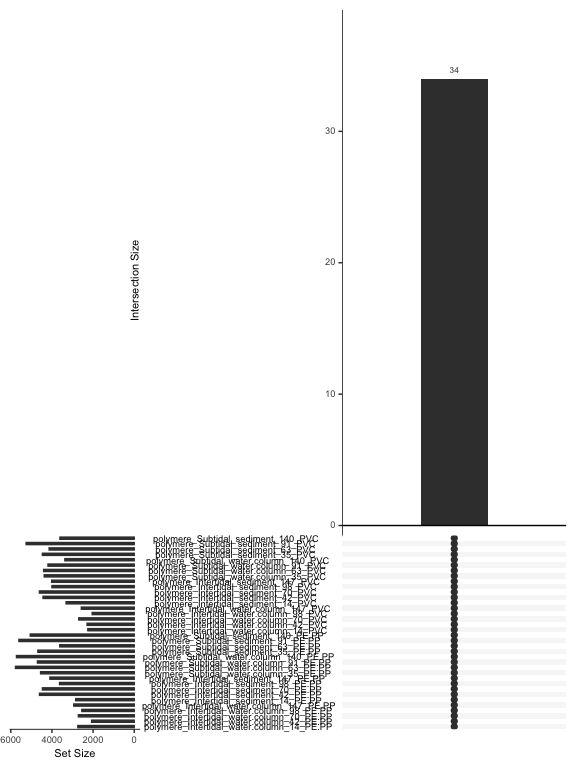
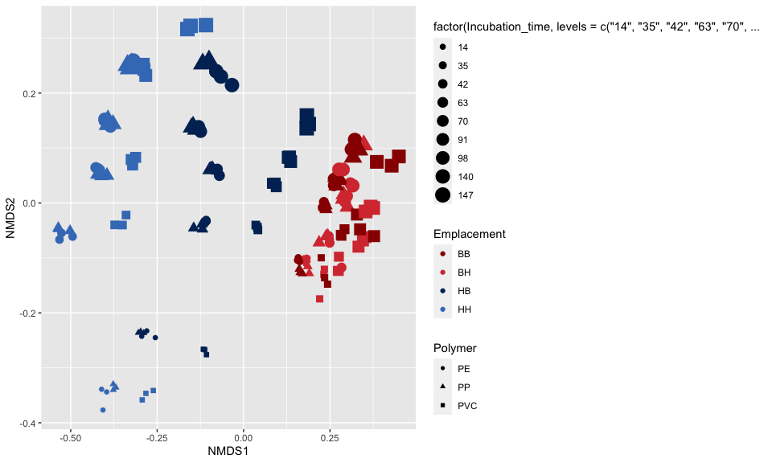
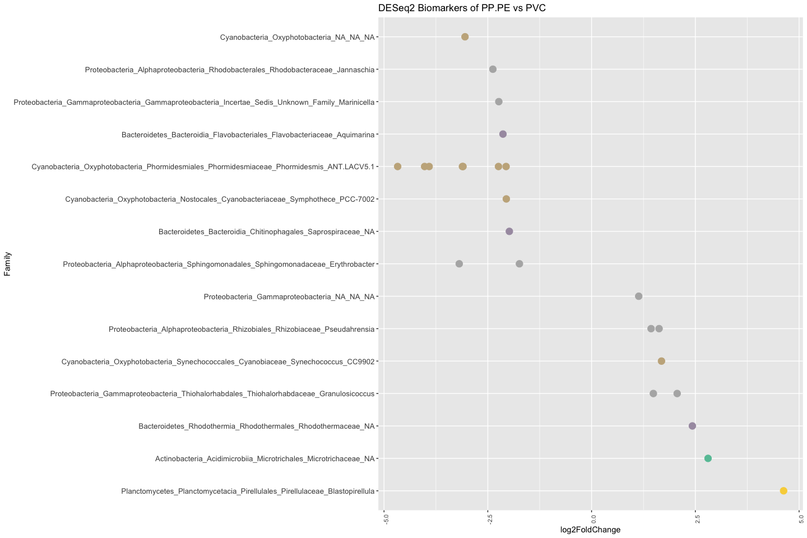
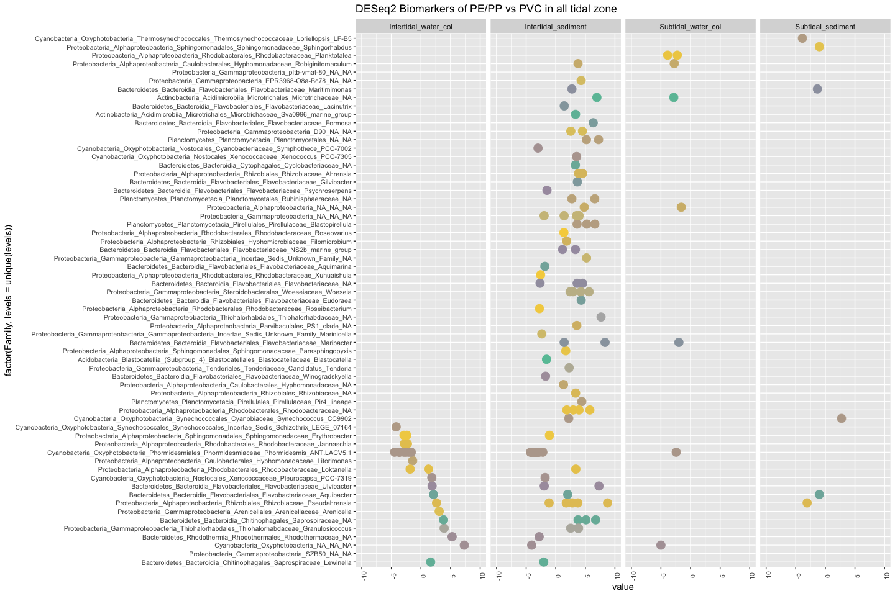
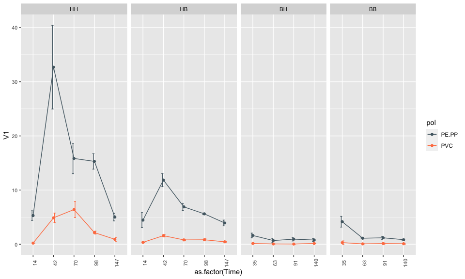
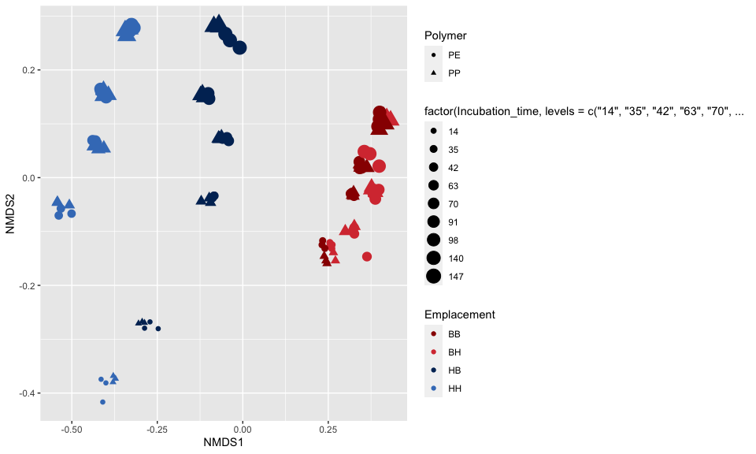
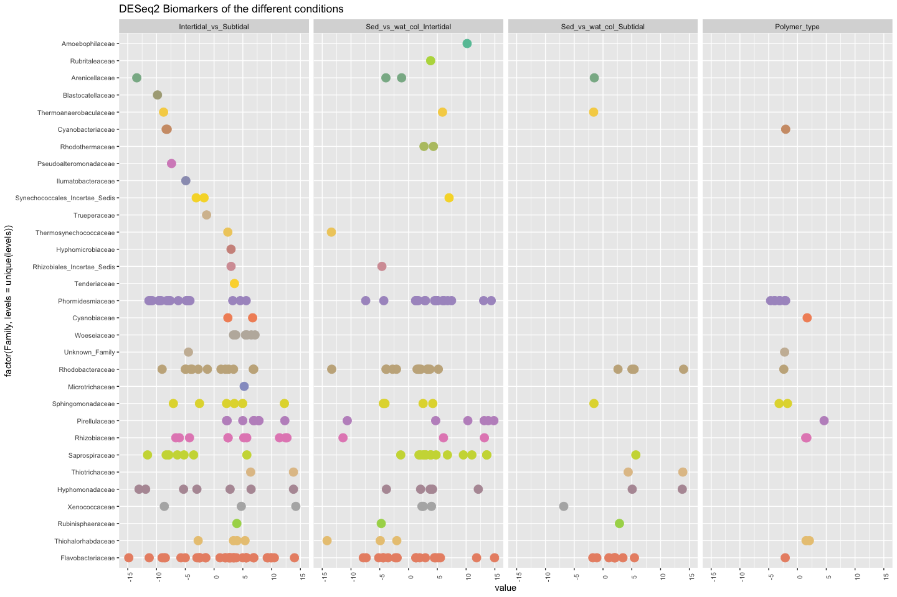

Plastic\_Q2
================

#### Question 2 : differences in bacterial communities between conditions in the long term survey

–\> What drive the bacterial community that will be find in different
conditions?

    1. Alpha-diversity
    2. Shared ASVs between all the different conditions
    3. Shared ASVs between the different polymer type
    4. Bray-Curtis dissimilarities between all the different conditions
    5. Biomarkers for PVC polymers
    6. Biomarkers for the different conditions.

# Prepare tables

## Alpha-diversity polymere type

``` r
library(phyloseq)
library(reshape2)
library(ggplot2)

alpha <- read.table("Plastic_alpha.txt", header=T, row.names=1)
alpha <- as.data.frame(alpha)
colnames(alpha) <- c("Observed", "invSimpson", "Shannon","Simpson")
alpha <- alpha[order(row.names(alpha)),]
alpha <- alpha[rownames(alpha) %in% rownames(meta),]
alpha$polymere <- meta$Polymere_type
alpha$Position <- meta$Position_estran

df <- cbind(samples = rownames(alpha), alpha)
df_m <- melt(df, id.vars=c("samples","Position","polymere"))
df_m <- na.omit(df_m)

p <- ggplot(data=df_m, aes(x=polymere, y=value)) +
  geom_boxplot() +
  facet_grid(variable~., scales="free",space="free_x") + ggtitle("Alpha diversity_Position_estran") +
  guides(fill=FALSE)
```



## Alpha-diversity position estran

``` r
library(phyloseq)
library(reshape2)
library(ggplot2)

alpha <- read.table("Plastic_alpha.txt", header=T, row.names=1)
alpha <- as.data.frame(alpha)
colnames(alpha) <- c("Observed", "invSimpson", "Shannon","Simpson")
alpha <- alpha[rownames(alpha) %in% rownames(meta),]
alpha <- alpha[order(row.names(alpha)),]
alpha$Position <- meta$Position_estran

df <- cbind(samples = rownames(alpha), alpha)
df_m <- melt(df, id.vars=c("samples","Position"))

df_m <- na.omit(df_m)
df_m$Position <- factor(df_m$Position, levels= c("HH","HB","BH","BB"))

p <- ggplot(data=df_m, aes(x=Position, y=value)) +
  geom_boxplot() +
  facet_grid(variable~., scales="free",space="free_x") + ggtitle("Alpha diversity_Position_estran") +
  guides(fill=FALSE)
```



# Shared ASVs between different polymer type (PE - PP and PVC)

``` r
library(UpSetR)

df <- cbind(samples = rownames(OTU_subset), OTU_subset)
df$condition <- meta$Polymere_type
df_m <- melt(df, id.vars=c("samples", "condition"))

mcast <- dcast(df_m, condition ~ variable, sum)
mcastt <- t(mcast)
colnames(mcastt) <- mcastt[1,]
mcastt <- mcastt[-1,]
mcastt <- as.data.frame(mcastt)

write.table(mcastt, "mcastt.txt", sep="\t")
mcastt <- read.table("mcastt.txt", header=T, row.names=1)
mcastt[mcastt > 1] <- 1

# Using UpSetR

p1 <- upset(mcastt, 
               sets = c("PE","PP","PVC"), 
               keep.order=T, 
               order.by = "freq")
```



# Shared communities between all conditions tested (Zone, time and polymer) plastics

``` r
meta$condition <- paste(meta$Filter_size, meta$Zone, meta$Emplacement, meta$Jour_.incubation, meta$Polymere,  sep="_")

df <- cbind(samples = rownames(OTU_subset), OTU_subset)
df$condition <- meta$condition
df_m <- melt(df, id.vars=c("samples", "condition"))

mcast <- dcast(df_m, condition ~ variable, sum)
mcastt <- t(mcast)
colnames(mcastt) <- mcastt[1,]
mcastt <- mcastt[-1,]
mcastt <- as.data.frame(mcastt)
#colnames(mcastt) <- c("P_1", "FL_1", "AT_5", "AT_60", "POL")

write.table(mcastt, "mcastt.txt", sep="\t")
mcastt <- read.table("mcastt.txt", header=T, row.names=1)

mcastt[mcastt > 1] <- 1

p2 <- upset(mcastt, 
               keep.order=T, 
               order.by = "freq",
               intersections = list(c("polymere_Intertidal_water.column_14_PE.PP","polymere_Intertidal_water.column_42_PE.PP", "polymere_Intertidal_water.column_70_PE.PP", "polymere_Intertidal_water.column_98_PE.PP","polymere_Intertidal_water.column_147_PE.PP","polymere_Intertidal_sediment_14_PE.PP","polymere_Intertidal_sediment_42_PE.PP",  "polymere_Intertidal_sediment_70_PE.PP", "polymere_Intertidal_sediment_98_PE.PP","polymere_Intertidal_sediment_147_PE.PP", "polymere_Subtidal_water.column_35_PE.PP", "polymere_Subtidal_water.column_63_PE.PP", "polymere_Subtidal_water.column_91_PE.PP", "polymere_Subtidal_water.column_140_PE.PP", "polymere_Subtidal_sediment_35_PE.PP", "polymere_Subtidal_sediment_63_PE.PP", "polymere_Subtidal_sediment_91_PE.PP","polymere_Subtidal_sediment_140_PE.PP", "polymere_Intertidal_water.column_14_PVC","polymere_Intertidal_water.column_42_PVC", "polymere_Intertidal_water.column_70_PVC", "polymere_Intertidal_water.column_98_PVC","polymere_Intertidal_water.column_147_PVC", "polymere_Intertidal_sediment_14_PVC","polymere_Intertidal_sediment_42_PVC",  "polymere_Intertidal_sediment_70_PVC", "polymere_Intertidal_sediment_98_PVC","polymere_Intertidal_sediment_147_PVC", "polymere_Subtidal_water.column_35_PVC", "polymere_Subtidal_water.column_63_PVC", "polymere_Subtidal_water.column_91_PVC", "polymere_Subtidal_water.column_140_PVC", "polymere_Subtidal_sediment_35_PVC", "polymere_Subtidal_sediment_63_PVC", "polymere_Subtidal_sediment_91_PVC","polymere_Subtidal_sediment_140_PVC")))
```



Only 34 ASVs were shared between all the plastics on the different
conditions tested (Time, zone, Emplacement and polymer
type)

# Bray-Curtis dissimilarities for bacterial communities associated to plastics pellets

### NMDS

``` r
library(vegan)
library(ggplot2)


df <- as.matrix(otu_subset)
bray <- vegdist(df, method="bray")
nmds <- metaMDS(bray, wascore = F)


data.score <- as.data.frame(scores(nmds))
data.score$site <- rownames(data.score)

data.score$Emplacement <- meta$Position_estran
data.score$Incubation_time <- meta$Jour_.incubation
data.score$Polymer <- meta$Polymere_type


p2 <- ggplot(data=data.score, aes(x=NMDS1, y=NMDS2, colour = Emplacement)) +
  geom_point(data=data.score, aes(x=NMDS1, y=NMDS2, size=factor(Incubation_time, levels=c("14","35","42","63","70","91","98","140","147")), shape=Polymer)) +
  scale_colour_manual(values=c("#990000","#d73b3e","#002e63","#417dc1")) 
```



\#PERMANOVA PP vs
PE

``` r
# Test which parameter influence the bacterial composition on plastic pellets.

meta_spe <- subset(meta, Polymere_type != "PVC")

df <- otu_subset[rownames(otu_subset) %in% rownames(meta_spe),]
df <- as.data.frame(df)
meta_spe <- meta_spe[ order(row.names(meta_spe)), ]


adonis(formula = df ~ Polymere_type , 
       #strata = meta$Position_estran, 
       data = meta_spe,
       permutations = 999, 
       method = "bray", 
       binary = TRUE)
```

    ## 
    ## Call:
    ## adonis(formula = df ~ Polymere_type, data = meta_spe, permutations = 999,      method = "bray", binary = TRUE) 
    ## 
    ## Permutation: free
    ## Number of permutations: 999
    ## 
    ## Terms added sequentially (first to last)
    ## 
    ##                Df SumsOfSqs MeanSqs F.Model    R2 Pr(>F)
    ## Polymere_type   1    0.1191 0.11910 0.42616 0.004  0.985
    ## Residuals     106   29.6227 0.27946         0.996       
    ## Total         107   29.7418                 1.000

\#PERMANOVA PP vs
PVC

``` r
# Test which parameter influence the bacterial composition on plastic pellets.

meta_spe <- subset(meta, Polymere_type != "PE")

df <- otu_subset[rownames(otu_subset) %in% rownames(meta_spe),]
df <- as.data.frame(df)
meta_spe <- meta_spe[ order(row.names(meta_spe)), ]


adonis(formula = df ~ Polymere_type , 
       #strata = meta$Position_estran, 
       data = meta_spe,
       permutations = 999, 
       method = "bray", 
       binary = TRUE)
```

    ## 
    ## Call:
    ## adonis(formula = df ~ Polymere_type, data = meta_spe, permutations = 999,      method = "bray", binary = TRUE) 
    ## 
    ## Permutation: free
    ## Number of permutations: 999
    ## 
    ## Terms added sequentially (first to last)
    ## 
    ##                Df SumsOfSqs MeanSqs F.Model      R2 Pr(>F)   
    ## Polymere_type   1    0.8797 0.87965  3.1948 0.02926  0.006 **
    ## Residuals     106   29.1863 0.27534         0.97074          
    ## Total         107   30.0659                 1.00000          
    ## ---
    ## Signif. codes:  0 '***' 0.001 '**' 0.01 '*' 0.05 '.' 0.1 ' ' 1

\#PERMANOVA PE vs PVC

``` r
meta_spe <- subset(meta, Polymere_type != "PP")

df <- otu_subset[rownames(otu_subset) %in% rownames(meta_spe),]
df <- as.data.frame(df)
meta_spe <- meta_spe[ order(row.names(meta_spe)), ]


adonis(formula = df ~ Polymere_type , 
       #strata = meta$Position_estran, 
       data = meta_spe,
       permutations = 999, 
       method = "bray", 
       binary = TRUE)
```

    ## 
    ## Call:
    ## adonis(formula = df ~ Polymere_type, data = meta_spe, permutations = 999,      method = "bray", binary = TRUE) 
    ## 
    ## Permutation: free
    ## Number of permutations: 999
    ## 
    ## Terms added sequentially (first to last)
    ## 
    ##                Df SumsOfSqs MeanSqs F.Model      R2 Pr(>F)    
    ## Polymere_type   1    0.9183 0.91825  3.3431 0.03057  0.001 ***
    ## Residuals     106   29.1149 0.27467         0.96943           
    ## Total         107   30.0332                 1.00000           
    ## ---
    ## Signif. codes:  0 '***' 0.001 '**' 0.01 '*' 0.05 '.' 0.1 ' ' 1

# Generate a table of abundant OTUs

``` r
# Keep only abundant biomarkers (relative abundance > 0.5 in at least one sample)

df <- t(as.data.frame(otu_subset))
df[df < 0.5] <- 0
df <- as.data.frame(df)
df$tot <- rowSums(df)
OTU_abund <- subset(df, tot >= 0.5)
```

\#Biomarkers of PP/PE vs PVC for all long-incubation polymers

``` r
# Using DESeq2 package

library(DESeq2)
library(phyloseq)
library(ggplot2)
library(reshape2)
library(RColorBrewer)

#Create Phyloseq object
OTU <- otu_table(t(OTU_subset), taxa_are_rows= T)
META <- sample_data(meta)
Phymatrice <- phyloseq(OTU, META)

# Run DESeq
deseq = phyloseq_to_deseq2(Phymatrice, ~ Polymere)
deseq <- DESeq(deseq)
resLFC <- lfcShrink(deseq, coef="Polymere_PVC_vs_PE.PP", type="apeglm")

# Filter by padj and log2FoldChange
resSub <- subset(resLFC, padj < 0.01 & log2FoldChange > 1 | log2FoldChange < -1)
Sub.Pol <- as.data.frame(resSub)
Sub.Pol <- Sub.Pol[rownames(Sub.Pol) %in% rownames(OTU_abund),]


Sub.Pol <- cbind(taxa = rownames(Sub.Pol), Sub.Pol)
Sub <- Sub.Pol[order(Sub.Pol$log2FoldChange, decreasing=F),]
levels <- as.factor(Sub$taxa)
Sub$taxa <- factor(Sub$taxa, levels=levels)

taxtable <- read.table("DADA2_Plastic_OTU_tax.txt", header=T, row.names=1, sep="\t")
taxtable <- as.data.frame(taxtable)
taxtable$taxa <- paste(taxtable$Phylum,taxtable$Class,taxtable$Order, taxtable$Family, taxtable$Genus, sep="_")

Sub$Family = taxtable[match(Sub$taxa, rownames(taxtable)),"taxa"]
Sub$Genus = taxtable[match(Sub$taxa, rownames(taxtable)),"Phylum"]

x = tapply(Sub$log2FoldChange, Sub$Family, function(x) max(x))
x = sort(x, TRUE)
Sub$Family = factor(as.character(Sub$Family), levels=names(x))

col.pal <- brewer.pal(8, "Set2")
col.pal = colorRampPalette(col.pal)(5)


gg <- ggplot(Sub, aes(x=Family, y = log2FoldChange, colour= Genus)) + 
  #geom_bar(stat = "identity", position = "stack") +
  geom_point(size=4) +
  theme(strip.text.y = element_text(size = 10, angle = 0), axis.text.x = element_text(size = 8 , angle = 90), axis.text.y = element_text(size = 10), legend.position="none") +
  coord_flip() +
  scale_color_manual(values=col.pal) +
  ggtitle("DESeq2 Biomarkers of PP.PE vs PVC")
```

``` r
gg
```



\#Biomarkers of PP/PE vs PVC for all long-incubation polymers in
Intertidal high

``` r
# Using DESeq2 package


Samples <- subset_samples(Phymatrice, Position_estran=="HH")

deseq = phyloseq_to_deseq2(Samples, ~ Polymere)
deseq <- DESeq(deseq)

resLFC <- lfcShrink(deseq, coef="Polymere_PVC_vs_PE.PP", type="apeglm")
resSub <- subset(resLFC, padj < 0.01 & log2FoldChange > 1 | log2FoldChange < -1)

Sub.HH <- as.data.frame(resSub)
Sub.HH <- Sub.HH[rownames(Sub.HH) %in% rownames(OTU_abund),]
Sub.HH <- cbind(taxa = rownames(Sub.HH), Sub.HH)
```

\#Biomarkers of PP/PE vs PVC for all long-incubation polymers in
Intertidal low

``` r
Samples <- subset_samples(Phymatrice, Position_estran=="HB")

deseq = phyloseq_to_deseq2(Samples, ~ Polymere)
deseq <- DESeq(deseq)

resLFC <- lfcShrink(deseq, coef="Polymere_PVC_vs_PE.PP", type="apeglm")
resSub <- subset(resLFC, padj < 0.01 & log2FoldChange > 1 | log2FoldChange < -1)


Sub.HB <- as.data.frame(resSub)
Sub.HB <- Sub.HB[rownames(Sub.HB) %in% rownames(OTU_abund),]
Sub.HB <- cbind(taxa = rownames(Sub.HB), Sub.HB)
```

\#Biomarkers of PP/PE vs PVC for all long-incubation polymers in
Subtidal high

``` r
Samples <- subset_samples(Phymatrice, Position_estran=="BH")

deseq = phyloseq_to_deseq2(Samples, ~ Polymere)
deseq <- DESeq(deseq)

resLFC <- lfcShrink(deseq, coef="Polymere_PVC_vs_PE.PP", type="apeglm")
resSub <- subset(resLFC, padj < 0.01 & log2FoldChange > 1 | log2FoldChange < -1)

Sub.BH <- as.data.frame(resSub)
Sub.BH <- Sub.BH[rownames(Sub.BH) %in% rownames(OTU_abund),]

Sub.BH <- cbind(taxa = rownames(Sub.BH), Sub.BH)
```

\#Biomarkers of PP/PE vs PVC for all long-incubation polymers in
Subtidal low

``` r
Samples <- subset_samples(Phymatrice, Position_estran=="BB")

deseq = phyloseq_to_deseq2(Samples, ~ Polymere)
deseq <- DESeq(deseq)

resLFC <- lfcShrink(deseq, coef="Polymere_PVC_vs_PE.PP", type="apeglm")
resSub <- subset(resLFC, padj < 0.01 & log2FoldChange > 1 | log2FoldChange < -1)

Sub.BB <- as.data.frame(resSub)
Sub.BB <- Sub.BB[rownames(Sub.BB) %in% rownames(OTU_abund),]
Sub.BB <- cbind(taxa = rownames(Sub.BB), Sub.BB)
```

\#Combine biomarkers in a single plot

``` r
Sub.HH <- Sub.HH[,c(1,3)]
colnames(Sub.HH) <- c("taxa","Intertidal_water_col")
Sub.HB <- Sub.HB[,c(1,3)]
colnames(Sub.HB) <- c("taxa","Intertidal_sediment")
Sub.BH <- Sub.BH[,c(1,3)]
colnames(Sub.BH) <- c("taxa","Subtidal_water_col")
Sub.BB <- Sub.BB[,c(1,3)]
colnames(Sub.BB) <- c("taxa","Subtidal_sediment")


Sub.1 <- merge(Sub.HH, Sub.HB, by="taxa", all=T)
Sub.2 <- merge(Sub.1, Sub.BH, by="taxa", all=T)
Sub.3 <- merge(Sub.2, Sub.BB, by="taxa", all=T)

Sub <- Sub.3

Sub <- Sub[order(Sub$Intertidal_water_col, decreasing=T),]

Sub$Genus = taxtable[match(Sub$taxa, rownames(taxtable)),"Genus"]
Sub$Family = taxtable[match(Sub$taxa, rownames(taxtable)),"taxa"]
levels <- as.factor(Sub$Family)
#Sub$color = OTU_a[match(Sub$Genus, OTU_a$Genus),"color"]

col.pal = colorRampPalette(col.pal)(63)

Sub_m <- melt(Sub, id.vars=c("taxa","Genus","Family"))

gg <- ggplot(Sub_m, aes(x=factor(Family, levels=unique(levels)), y = value)) + 
  geom_point(aes(size=3, color=Family)) +
  theme(strip.text.y = element_text(size = 10, angle = 0), axis.text.x = element_text(size = 8 , angle = 90), axis.text.y = element_text(size = 8), legend.position="none") +
  coord_flip() +
  facet_grid(.~variable, scales="free", space="free_x") +
  scale_color_manual(values= col.pal) +
  scale_y_continuous(limits = c(-10,10), breaks=c(-10,-5,0,5,10)) +
  ggtitle("DESeq2 Biomarkers of PE/PP vs PVC in all tidal zone") 
```



# Distribution of Phormidium

``` r
# table abundance family


taxtable <- read.table("DADA2_Plastic_OTU_tax.txt", header=T, row.names=1, sep="\t")
taxtable <- as.data.frame(taxtable)

df <- as.data.frame(t(otu_subset))
df$Genus = taxtable[match(rownames(df), rownames(taxtable)),"Genus"]
df <- cbind(OTUs = rownames(df), df)
df_m <- melt(df, id.vars=c("OTUs", "Genus"))
mcast <- dcast(df_m, Genus ~ variable, sum)

mm <- subset(mcast, Genus == "Phormidesmis_ANT.LACV5.1")

rownames(mm) <- mm$taxa
mm <- mm[,-1]
df <- as.data.frame(t(mm))
df <- cbind(samples = rownames(df), df)
df <- df[df$samples %in% rownames(meta),]
meta <- meta[rownames(meta) %in% rownames(df),]

df$Time = meta[match(rownames(df), rownames(meta)),"Jour_.incubation"]
df$Emplacement = meta[match(rownames(df), rownames(meta)),"Position_estran"]
df$Zone = meta[match(rownames(df), rownames(meta)),"Zone"]
df$pol = meta[match(rownames(df), rownames(meta)),"Polymere"]


df_m <- melt(df, id.vars=c("samples", "Zone","Emplacement","Time","pol"))

mcast <- dcast(df_m, Zone + Emplacement + Time + pol  ~ variable, mean)
sdcast <- dcast(df_m, Zone + Emplacement + Time + pol ~ variable, sd)
colnames(sdcast) <- paste("sd", colnames(sdcast), sep="_")
mcast$sd <- sdcast$sd_V1

mcast$Emplacement <- factor(mcast$Emplacement, levels=c("HH","HB","BH","BB"))
mcast$Time <- factor(mcast$Time, levels=c("14","35","42","63","70","91","98","140","147"))

gg <- ggplot(mcast, aes(as.factor(Time), V1, colour= pol, group=pol)) + 
  geom_point() +
  geom_line() +
  geom_errorbar(aes(ymin= V1 - sd, ymax= V1 +sd),
                width=.2,                
                position="dodge") +
  scale_colour_manual(values=c("#536872","#ff7f50")) +
  theme(strip.text.y = element_text(size = 10, angle = 0), axis.text.x = element_text(size = 8 , angle = 90), axis.text.y = element_text(size = 8)) +
  facet_grid(.~Emplacement, scales="free", space="free_x") 
```



### NMDS for tidal level and time for PE/PP

``` r
library(vegan)
library(ggplot2)

df <- as.matrix(otu_subset)
meta_spe <- subset(meta, Polymere != "PVC")
df <- df[rownames(df) %in% rownames(meta_spe),]
bray <- vegdist(df, method="bray")
nmds <- metaMDS(bray, wascore = F)
```

    ## Run 0 stress 0.0528398 
    ## Run 1 stress 0.05283983 
    ## ... Procrustes: rmse 2.464243e-05  max resid 0.0001110638 
    ## ... Similar to previous best
    ## Run 2 stress 0.05284365 
    ## ... Procrustes: rmse 0.001433594  max resid 0.01017545 
    ## Run 3 stress 0.05284365 
    ## ... Procrustes: rmse 0.001416068  max resid 0.01011572 
    ## Run 4 stress 0.05283981 
    ## ... Procrustes: rmse 1.358308e-05  max resid 5.907907e-05 
    ## ... Similar to previous best
    ## Run 5 stress 0.05283981 
    ## ... Procrustes: rmse 8.56658e-06  max resid 3.26598e-05 
    ## ... Similar to previous best
    ## Run 6 stress 0.05283982 
    ## ... Procrustes: rmse 1.564413e-05  max resid 7.767947e-05 
    ## ... Similar to previous best
    ## Run 7 stress 0.05283982 
    ## ... Procrustes: rmse 1.693281e-05  max resid 7.296319e-05 
    ## ... Similar to previous best
    ## Run 8 stress 0.05284365 
    ## ... Procrustes: rmse 0.001412974  max resid 0.01010511 
    ## Run 9 stress 0.05284364 
    ## ... Procrustes: rmse 0.001420205  max resid 0.01012493 
    ## Run 10 stress 0.05283982 
    ## ... Procrustes: rmse 1.877558e-05  max resid 8.415762e-05 
    ## ... Similar to previous best
    ## Run 11 stress 0.05283981 
    ## ... Procrustes: rmse 1.358532e-05  max resid 0.0001006755 
    ## ... Similar to previous best
    ## Run 12 stress 0.05283983 
    ## ... Procrustes: rmse 2.125466e-05  max resid 9.664117e-05 
    ## ... Similar to previous best
    ## Run 13 stress 0.05284367 
    ## ... Procrustes: rmse 0.001414363  max resid 0.01011 
    ## Run 14 stress 0.05284364 
    ## ... Procrustes: rmse 0.001425622  max resid 0.0101476 
    ## Run 15 stress 0.05283982 
    ## ... Procrustes: rmse 2.221735e-05  max resid 0.0001010759 
    ## ... Similar to previous best
    ## Run 16 stress 0.05283982 
    ## ... Procrustes: rmse 1.827309e-05  max resid 8.375996e-05 
    ## ... Similar to previous best
    ## Run 17 stress 0.05283981 
    ## ... Procrustes: rmse 1.031807e-05  max resid 4.664266e-05 
    ## ... Similar to previous best
    ## Run 18 stress 0.05284364 
    ## ... Procrustes: rmse 0.001418431  max resid 0.01012392 
    ## Run 19 stress 0.05283982 
    ## ... Procrustes: rmse 2.215113e-05  max resid 0.0001005312 
    ## ... Similar to previous best
    ## Run 20 stress 0.05283983 
    ## ... Procrustes: rmse 2.646532e-05  max resid 0.0001200273 
    ## ... Similar to previous best
    ## *** Solution reached

``` r
data.score <- as.data.frame(scores(nmds))
data.score$site <- rownames(data.score)

data.score$Emplacement <- meta_spe$Position_estran
data.score$Incubation_time <- meta_spe$Jour_.incubation
data.score$Polymer <- meta_spe$Polymere_type


p2 <- ggplot(data=data.score, aes(x=NMDS1, y=NMDS2, colour = Emplacement)) +
  geom_point(data=data.score, aes(x=NMDS1, y=NMDS2, size=factor(Incubation_time, levels=c("14","35","42","63","70","91","98","140","147")), shape=Polymer)) +
  scale_colour_manual(values=c("#990000","#d73b3e","#002e63","#417dc1")) 
```



\#PERMANOVA Intertidal vs Subtidal PE/PP

``` r
meta_spe <- subset(meta, Polymere_type != "PVC")

df <- otu_subset[rownames(otu_subset) %in% rownames(meta_spe),]
df <- as.data.frame(df)
meta_spe <- meta_spe[ order(row.names(meta_spe)), ]


adonis(formula = df ~ Zone , 
       data = meta_spe,
       permutations = 999, 
       method = "bray", 
       binary = TRUE)
```

    ## 
    ## Call:
    ## adonis(formula = df ~ Zone, data = meta_spe, permutations = 999,      method = "bray", binary = TRUE) 
    ## 
    ## Permutation: free
    ## Number of permutations: 999
    ## 
    ## Terms added sequentially (first to last)
    ## 
    ##            Df SumsOfSqs MeanSqs F.Model     R2 Pr(>F)    
    ## Zone        1    8.4645  8.4645  42.169 0.2846  0.001 ***
    ## Residuals 106   21.2773  0.2007         0.7154           
    ## Total     107   29.7418                 1.0000           
    ## ---
    ## Signif. codes:  0 '***' 0.001 '**' 0.01 '*' 0.05 '.' 0.1 ' ' 1

\#PERMANOVA seawater vs sediment PE/PP

``` r
meta_spe <- subset(meta, Polymere_type != "PVC")

df <- otu_subset[rownames(otu_subset) %in% rownames(meta_spe),]
df <- as.data.frame(df)
meta_spe <- meta_spe[ order(row.names(meta_spe)), ]


adonis(formula = df ~ Emplacement , 
       data = meta_spe,
       permutations = 999, 
       method = "bray", 
       binary = TRUE)
```

    ## 
    ## Call:
    ## adonis(formula = df ~ Emplacement, data = meta_spe, permutations = 999,      method = "bray", binary = TRUE) 
    ## 
    ## Permutation: free
    ## Number of permutations: 999
    ## 
    ## Terms added sequentially (first to last)
    ## 
    ##              Df SumsOfSqs MeanSqs F.Model      R2 Pr(>F)    
    ## Emplacement   1    2.3334 2.33342  9.0243 0.07846  0.001 ***
    ## Residuals   106   27.4084 0.25857         0.92154           
    ## Total       107   29.7418                 1.00000           
    ## ---
    ## Signif. codes:  0 '***' 0.001 '**' 0.01 '*' 0.05 '.' 0.1 ' ' 1

\#Biomarkers of Intertidal vs Subtidal for long-incubation polymers
without PVC

``` r
# Using DESeq2 package

library(DESeq2)
library(phyloseq)
library(ggplot2)
library(reshape2)
library(RColorBrewer)


#Samples <- subset_samples(Phymatrice, Position_estran=="HH")

OTU <- otu_table(t(OTU_subset), taxa_are_rows= T)
META <- sample_data(meta)
Phymatrice <- phyloseq(OTU, META)

Samples <- subset_samples(Phymatrice, Polymere_type !="PVC")

deseq = phyloseq_to_deseq2(Samples, ~ Zone)
deseq <- DESeq(deseq)

# Explore DESeq results
#plotMA(res, ylim = c(-5, 5))
#plotDispEsts(deseq, ylim = c(1e-6, 1e2) )
#hist( res$pvalue, breaks=20, col="grey" )
# create bins using the quantile function
#qs <- c( 0, quantile( res$baseMean[res$baseMean > 0], 0:7/7 ) )
# "cut" the genes into the bins
#bins <- cut( res$baseMean, qs )
# rename the levels of the bins using the middle point
#levels(bins) <- paste0("~",round(.5*qs[-1] + .5*qs[-length(qs)]))
# calculate the ratio of £p£ values less than .01 for each bin
#ratios <- tapply( res$pvalue, bins, function(p) mean( p < .01, na.rm=TRUE ) ) # plot these ratios
#barplot(ratios, xlab="mean normalized count", ylab="ratio of small $p$ values")

resLFC <- lfcShrink(deseq, coef="Zone_Subtidal_vs_Intertidal", type="apeglm")
resSub <- subset(resLFC, padj < 0.01 & log2FoldChange > 1 | log2FoldChange < -1)

Sub.Z <- as.data.frame(resSub)
Sub.Z <- Sub.Z[rownames(Sub.Z) %in% rownames(OTU_abund),]
Sub.Z <- cbind(taxa = rownames(Sub.Z), Sub.Z)
```

\#Biomarkers of Seawater vs Sediments in intertidal without PVC

``` r
# Using DESeq2 package

library(DESeq2)
library(phyloseq)
library(ggplot2)
library(reshape2)
library(RColorBrewer)

Samples <- subset_samples(Phymatrice, Polymere_type !="PVC")
Samples <- subset_samples(Samples, Zone =="Intertidal")

deseq = phyloseq_to_deseq2(Samples, ~ Emplacement)
deseq$Zone <- factor(deseq$Zone, levels = c("sediment","water.column"))
deseq <- DESeq(deseq)

resLFC <- lfcShrink(deseq, coef="Emplacement_water.column_vs_sediment", type="apeglm")
resSub <- subset(resLFC, padj < 0.01 & log2FoldChange > 1 | log2FoldChange < -1)

Sub.I <- as.data.frame(resSub)
Sub.I <- Sub.I[rownames(Sub.I) %in% rownames(OTU_abund),]

Sub.I <- cbind(taxa = rownames(Sub.I), Sub.I)
```

\#Biomarkers of Seawater vs Sediments in subtidal without PVC

``` r
# Using DESeq2 package

library(DESeq2)
library(phyloseq)
library(ggplot2)
library(reshape2)
library(RColorBrewer)


Samples <- subset_samples(Phymatrice, Polymere_type !="PVC")
Samples <- subset_samples(Samples, Zone =="Subtidal")

deseq = phyloseq_to_deseq2(Samples, ~ Emplacement)

deseq <- DESeq(deseq)

resLFC <- lfcShrink(deseq, coef="Emplacement_water.column_vs_sediment", type="apeglm")
resSub <- subset(resLFC, padj < 0.01 & log2FoldChange > 1 | log2FoldChange < -1)

Sub.S <- as.data.frame(resSub)
Sub.S <- Sub.S[rownames(Sub.S) %in% rownames(OTU_abund),]
Sub.S <- cbind(taxa = rownames(Sub.S), Sub.S)
```

\#Combine biomarkers in a single plot

``` r
Sub.I <- Sub.I[,c(1,3)]
colnames(Sub.I) <- c("taxa","Sed_vs_wat_col_Intertidal")
Sub.Z <- Sub.Z[,c(1,3)]
colnames(Sub.Z) <- c("taxa","Intertidal_vs_Subtidal")
Sub.S <- Sub.S[,c(1,3)]
colnames(Sub.S) <- c("taxa","Sed_vs_wat_col_Subtidal")
Sub.Pol <- Sub.Pol[,c(1,3)]
colnames(Sub.Pol) <- c("taxa","Polymer_type")


Sub.T <- merge(Sub.I, Sub.S, by="taxa", all=T)
Sub.T <- merge(Sub.T, Sub.Z, by="taxa", all=T)
Sub.T <- merge(Sub.T, Sub.Pol, by="taxa", all=T)


Sub.T <- Sub.T[order(Sub.T$Intertidal_vs_Subtidal, decreasing=T),]

taxtable$taxa <- paste(taxtable$Phylum,taxtable$Class,taxtable$Order, taxtable$Family, sep="_")

Sub.T$Genus = taxtable[match(Sub.T$taxa, rownames(taxtable)),"Genus"]
Sub.T$Family = taxtable[match(Sub.T$taxa, rownames(taxtable)),"Family"]
levels <- as.factor(Sub.T$Family)


Sub_m <- melt(Sub.T, id.vars=c("taxa","Genus","Family"))
Sub_m <- na.omit(Sub_m)
Sub_m$variable <- factor(Sub_m$variable, levels = c("Intertidal_vs_Subtidal","Sed_vs_wat_col_Intertidal","Sed_vs_wat_col_Subtidal","Polymer_type"))

col.pal <- brewer.pal(8, "Set2")
col.pal = colorRampPalette(col.pal)(31)

gg <- ggplot(Sub_m, aes(x=factor(Family, levels=unique(levels)), y = value)) + 
  #geom_bar(stat = "identity", position = "stack") +
  geom_point(aes(size=2, color=Family)) +
  theme(strip.text.y = element_text(size = 10, angle = 0), axis.text.x = element_text(size = 8 , angle = 90), axis.text.y = element_text(size = 8), legend.position="none") +
  coord_flip() +
  facet_grid(.~variable, scales="free", space="free_x") +
  scale_color_manual(values=col.pal) +
  scale_y_continuous(limits = c(-15,15), breaks=c(-15,-10,-5,0,5,10,15)) +
  ggtitle("DESeq2 Biomarkers of the different conditions ") 
```


