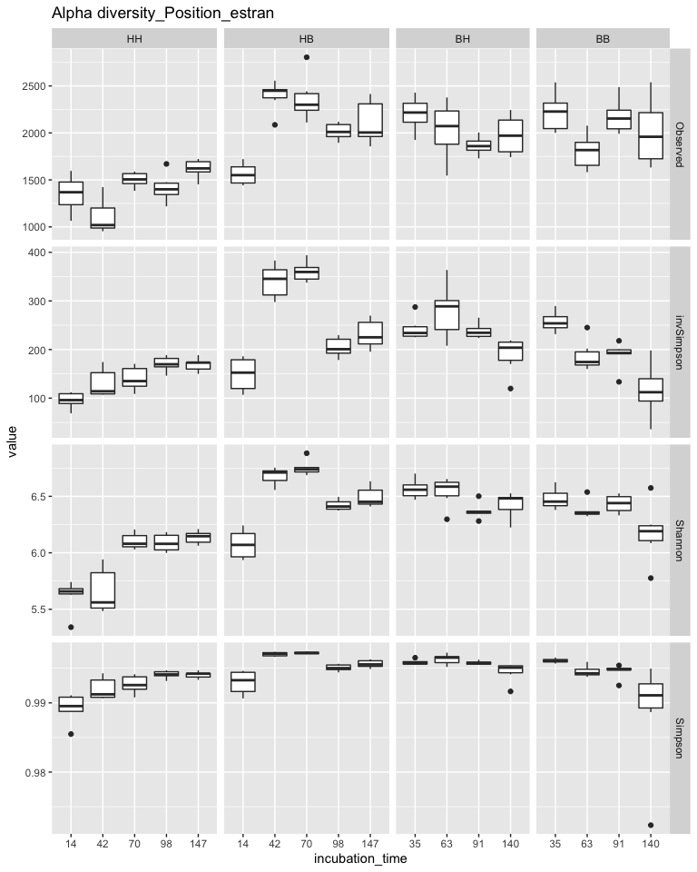
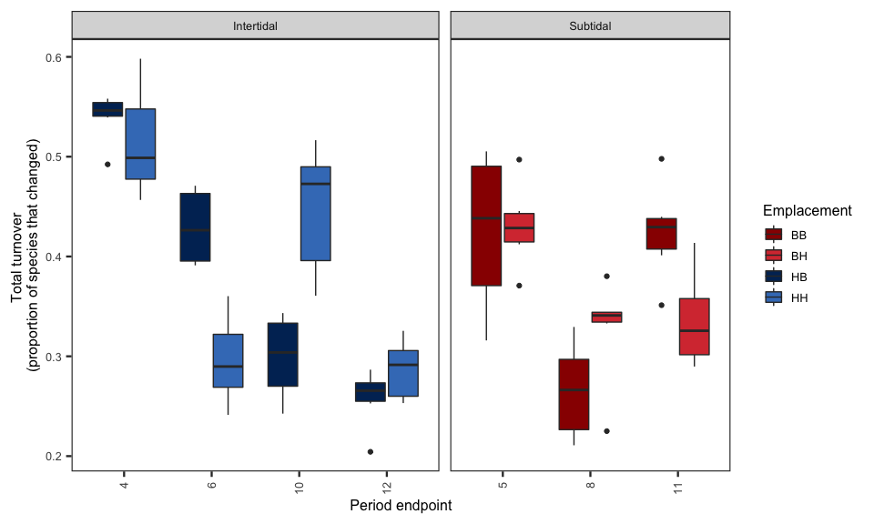
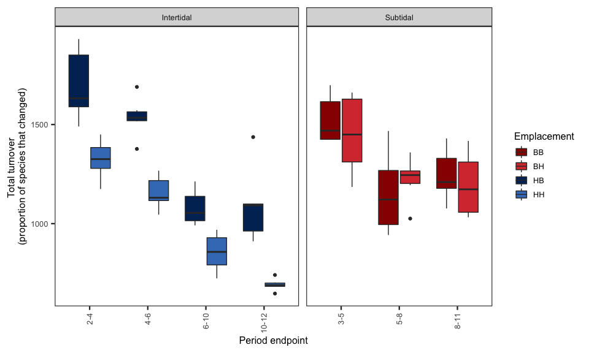
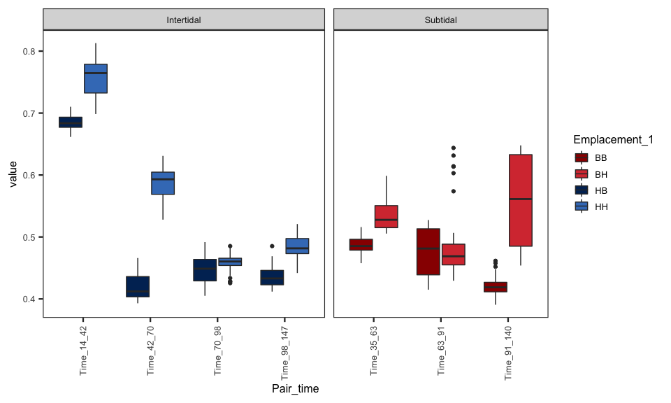
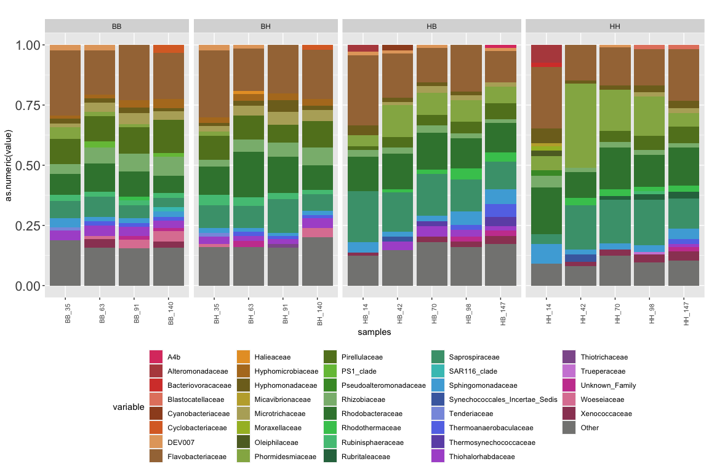
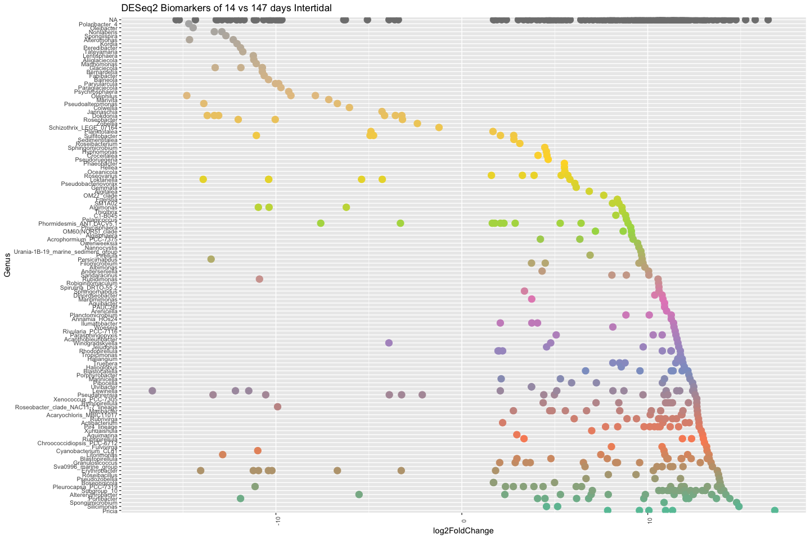
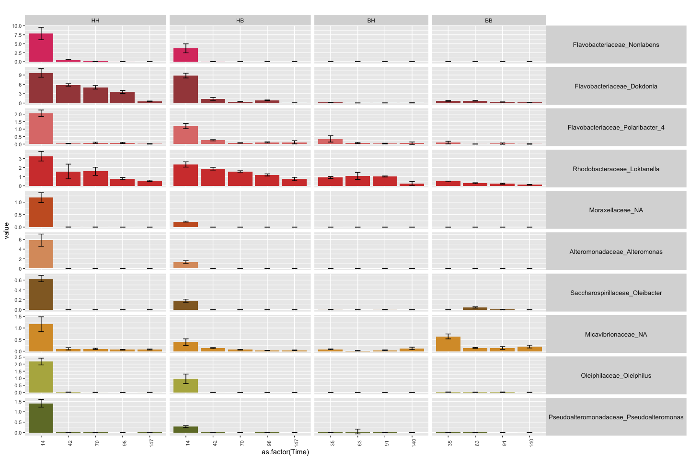
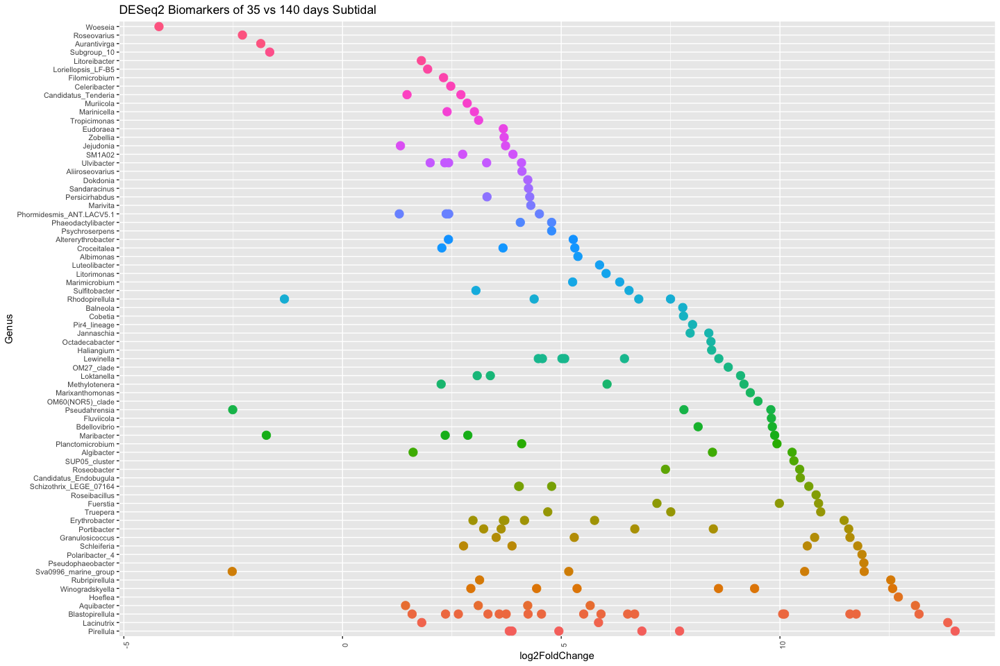
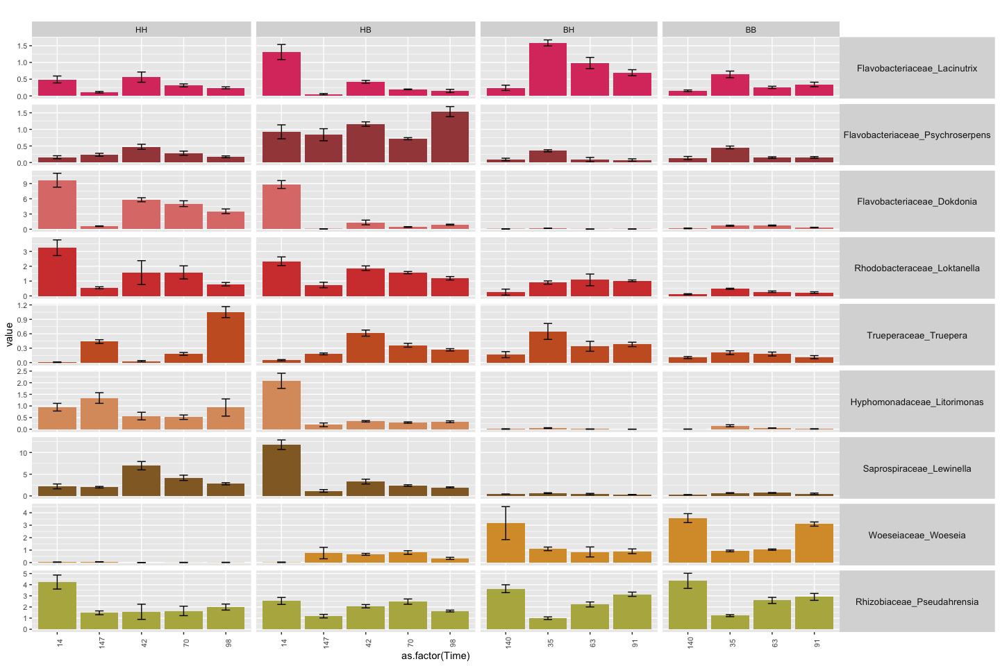

Plastics\_Q3
================

#### Question 3 : Temporal assembly process on plastic pellets

We saw that some the condition of incubation are key factors shaping
bacterial biofilm composition that form on the surface of plastic
pellets in the marine environment.

    1. Alpha-diversity
    2. Bray-Curtis dissimilarities for short incubation polymers
    3. Turn over in bray curtis dissimilarities and phylogenetic distances for the different conditions
    4. Barplot main families/order that evolve in time 

# Prepare tables

## Alpha-diversity

``` r
library(phyloseq)
library(reshape2)
library(ggplot2)

alpha <- read.table("Plastic_alpha.txt", header=T, row.names=1)
alpha <- as.data.frame(alpha)
colnames(alpha) <- c("Observed", "invSimpson", "Shannon","Simpson")
alpha <- alpha[order(row.names(alpha)),]

alpha <- alpha[rownames(alpha) %in% rownames(meta),]

alpha$polymere <- meta$Polymere_type
alpha$Position <- meta$Position_estran
alpha$incubation_time <- meta$Jour_.incubation

df <- cbind(samples = rownames(alpha), alpha)
df_m <- melt(df, id.vars=c("samples","Position","incubation_time","polymere"))

df_m <- na.omit(df_m)
df_m$Position <- factor(df_m$Position, levels= c("HH","HB","BH","BB"))
df_m$incubation_time <- factor(df_m$incubation_time, levels= c("7","14","42","70","98","147","35","63","91","140"))

p <- ggplot(data=df_m, aes(x=incubation_time, y=value)) +
  geom_boxplot() +
  facet_grid(variable~Position, scales="free",space="free_x") + ggtitle("Alpha diversity_Position_estran") +
  guides(fill=FALSE)
```



HH: Intertidal water column HB: Intertidal sediment BH: Subtidal water
column BB: Subtidal sediment

# Load functions from the codyn package for temporal assembly analysis

# Turnover OTUs

``` r
library("reshape2")
library("ggplot2")

df <- as.data.frame(OTU_subset) 

df$Emplacement <- meta$Position_estran
df$Time <- meta$Jour_.incubation
df$Polymer <- meta$Polymere
df$condition <- meta$meta

df_m <- melt(df, id.vars=c("Emplacement","Time","Polymer","condition"))
colnames(df_m) <- c("Emplacement","Time","Polymer","condition","OTU","abund")

df_m$Time <- as.numeric(df_m$Time)


# here, calcul of the total turnover. write "appearance" or "disappearance" for more specific metrics.
total.to <- turnover(df_m, time.var = "Time", species.var = "OTU", abundance.var = "abund", replicate.var="condition", metric="appearance") 

total.to$Zone = meta[match(total.to$condition, meta$meta),"Zone"]
total.to$Emplacement = meta[match(total.to$condition, meta$meta),"Position_estran"]
total.to$Polymer = meta[match(total.to$condition, meta$meta),"Polymere_type"]

gg <- ggplot(total.to, aes(x=as.factor(Time), y=appearance)) +
  geom_boxplot(aes(fill=Emplacement)) +
  ylab("Total turnover \n(proportion of species that changed)") + 
  xlab("Period endpoint") +
  guides(colour=guide_legend(title="Transect")) +
  theme_bw(base_size = 18) +
  theme(panel.grid.major = element_blank (), # remove major grid
        panel.grid.minor = element_blank (), text = element_text(size = 12), 
        axis.text.x = element_text(angle = 90, vjust = 0.5, hjust = 1)) +
  scale_fill_manual(values=c("#990000","#d73b3e","#002e63","#417dc1")) +
  facet_grid(.~Zone, scales="free", space="free_x")
```



# Species rank shift

``` r
total.to <- rank_shift(df_m, time.var = "Time", species.var = "OTU", abundance.var = "abund", replicate.var="condition")

total.to$Zone = meta[match(total.to$condition, meta$meta),"Zone"]
total.to$Emplacement = meta[match(total.to$condition, meta$meta),"Position_estran"]
total.to$Polymer = meta[match(total.to$condition, meta$meta),"Polymere_type"]

total.to$year_pair <- factor(total.to$year_pair, levels=c("2-4","4-6","6-10","10-12","3-5","5-8","8-11"))

gg_2 <- ggplot(total.to, aes(x=as.factor(year_pair), y=MRS)) +
  geom_boxplot(aes(fill=Emplacement)) +
  ylab("Total turnover \n(proportion of species that changed)") + 
  xlab("Period endpoint") +
  guides(colour=guide_legend(title="Transect")) +
  theme_bw(base_size = 18) +
  theme(panel.grid.major = element_blank (), # remove major grid
        panel.grid.minor = element_blank (), text = element_text(size = 12), 
        axis.text.x = element_text(angle = 90, vjust = 0.5, hjust = 1)) +
  scale_fill_manual(values=c("#990000","#d73b3e","#002e63","#417dc1")) +
  facet_grid(.~Zone, scales="free", space="free_x")
```



# Rate of community change based on bray-curtis

``` r
library(vegan)
library(ggplot2)


df <- as.data.frame(otu_subset)

bray <- vegdist(df, method="bray")
#bray <- vegdist(OTU_subset, method="jaccard", binary=T)


# First, have to convert the bray symetric matrix

df <-  as.matrix(bray)


melted_df <- melt(df, na.rm = TRUE)

melted_df$Time_1 = meta[match(melted_df$Var1, rownames(meta)), "Jour_.incubation"]
melted_df$Time_2 = meta[match(melted_df$Var2, rownames(meta)), "Jour_.incubation"]


melted_df[melted_df$Time_1 == "14" & melted_df$Time_2 == "42" , "Pair_time"] <- "Time_14_42"
melted_df[melted_df$Time_1 == "42" & melted_df$Time_2 == "70" , "Pair_time"] <- "Time_42_70"
melted_df[melted_df$Time_1 == "70" & melted_df$Time_2 == "98" , "Pair_time"] <- "Time_70_98"
melted_df[melted_df$Time_1 == "98" & melted_df$Time_2 == "147" , "Pair_time"] <- "Time_98_147"
melted_df[melted_df$Time_1 == "35" & melted_df$Time_2 == "63" , "Pair_time"] <- "Time_35_63"
melted_df[melted_df$Time_1 == "63" & melted_df$Time_2 == "91" , "Pair_time"] <- "Time_63_91"
melted_df[melted_df$Time_1 == "91" & melted_df$Time_2 == "140" , "Pair_time"] <- "Time_91_140"


melted_df <- na.omit(melted_df)

melted_df$Polymer_1= meta[match(melted_df$Var1, rownames(meta)), "Zone"]
melted_df$Polymer_2= meta[match(melted_df$Var2, rownames(meta)), "Zone"]
melted_df$Emplacement_1 = meta[match(melted_df$Var1, rownames(meta)), "Position_estran"]
melted_df$Emplacement_2 = meta[match(melted_df$Var2, rownames(meta)), "Position_estran"]

df <- melted_df[melted_df$Polymer_1==melted_df$Polymer_2, ]
df <- df[df$Emplacement_1==df$Emplacement_2, ]


gg_3 <- ggplot(df, aes(x=Pair_time, y=value), na.rm=T) +
  geom_boxplot(aes(fill=Emplacement_1)) +
  theme_bw(base_size = 18) +
  theme(panel.grid.major = element_blank (), # remove major grid
        panel.grid.minor = element_blank (), text = element_text(size = 12), 
        axis.text.x = element_text(angle = 90, vjust = 0.5, hjust = 1)) +
facet_grid(.~ Polymer_1, scales="free", space="free_x") +
  scale_fill_manual(values=c("#990000","#d73b3e","#002e63","#417dc1"))
```



## Family evolution with time in the different conditions

``` r
# Create a matrix table with Families

meta$condition <- paste(meta$Position_estran, meta$Jour_.incubation, sep="_")

taxtable <- read.table("DADA2_Plastic_OTU_tax.txt", header=T, row.names=1, sep="\t")
taxtable <- as.data.frame(taxtable)

OTU_t <- as.data.frame(t(otu_subset))
OTU_t$Family = taxtable[match(rownames(OTU_t), rownames(taxtable)),"Family"]

df <- cbind(OTUs = rownames(OTU_t), OTU_t)
df_m <- melt(df, id.vars=c("OTUs", "Family"))
mcast <- dcast(df_m, Family ~ variable, sum)

# Mean by condition
mcast <- na.omit(mcast)
rownames(mcast) <- mcast$Family
mcast <- mcast[,-1]
otu.perc <- as.data.frame(t(mcast))
otu.perc$condition = meta[match(rownames(otu.perc), rownames(meta)),"condition"]
otu.perc <- cbind(samples = rownames(otu.perc), otu.perc) 

df_m <- melt(otu.perc, id.vars=c("samples", "condition"))
mcast <- dcast(df_m, condition ~ variable, mean)
rownames(mcast) <- mcast$condition
mcast <- mcast[,-1]
otu.perc <- as.data.frame(t(mcast))

# Families above 1% in sample

sumneg <- function(x) sum(x[x<1])
#write.table (mcast, "OTU_subset.txt", sep="\t")
#OTU <- read.table("OTU_subset.txt", header=1, row.names=1)
OTU <- as.data.frame(t(otu.perc))
OTU$Other <- apply(OTU,1,sumneg)
m <- OTU
OTU[OTU < 1] <- NA
OTU$Other <- m$Other


df <- cbind(samples = rownames(OTU), OTU)
df$Zone = meta[match(df$samples, meta$condition),"Position_estran"]

df_m <- melt(df, id.vars=c("samples","Zone"))
df_m <- na.omit(df_m)

col.pal = c("#dc406f","#b64b4c","#d64237","#e4836d","#9e4e25","#db6d2d","#e3a66b","#a57544","#e79e2f","#b37a24","#7f6e23","#c0ab39","#b6ac68","#a5ba2e","#5e6b2c","#94b152","#628024","#75c046","#459731","#89b87d","#3a823c","#41c65d","#51c284","#2d724d","#489f7b","#42c2bf","#4cacdb","#496bae","#899be0","#6577e7","#6e54b4","#ad59d0","#8f5c9a","#cf88d8","#c9469e","#de82a1","#9b4463","#848482")

df_m$samples <- factor(df_m$samples, levels=c("HB_14","HB_42","HB_70","HB_98","HB_147","HH_14","HH_42","HH_70","HH_98","HH_147","BB_35","BB_63","BB_91","BB_140","BH_35","BH_63","BH_91","BH_140"))

gg <- ggplot(df_m, aes(x=samples, y = as.numeric(value), fill=variable)) +
  geom_bar(stat = "identity", position = "fill") +
  theme(strip.text.y = element_text(size = 10, angle = 0), axis.text.x = element_text(size = 8 , angle = 90), axis.text.y = element_text(size = 16), legend.position="bottom") +
  facet_grid(.~Zone, scales="free", space="free_x") +
  #guides(fill=FALSE) 
  scale_fill_manual(values= col.pal) +
  ggtitle("")
```



### Biomarkers early incubation vs late (14 days vs 147) in Intertidal

``` r
# Using DESeq2 package

library(DESeq2)
library(phyloseq)
library(ggplot2)
library(reshape2)
library(RColorBrewer)


# Create Phyloseq object
OTU <- otu_table(t(OTU_subset), taxa_are_rows= T)
META <- sample_data(meta)
Phymatrice <- phyloseq(OTU, META)

Samples <- subset_samples(Phymatrice, Zone=="Intertidal")
Samples <- subset_samples(Samples, Jour_.incubation=="14" | Jour_.incubation=="147")

# Run DESeq
deseq = phyloseq_to_deseq2(Samples, ~ as.factor(Jour_.incubation))
deseq <- DESeq(deseq)
resLFC <- lfcShrink(deseq, coef="as.factor.Jour_.incubation.147", type="apeglm")
resSub <- subset(resLFC, padj < 0.01 & log2FoldChange > 1 | log2FoldChange < -1)

Sub.IH <- as.data.frame(resSub)
Sub.IH <- cbind(taxa = rownames(Sub.IH), Sub.IH)
  
Sub.IH <- Sub.IH[order(Sub.IH$log2FoldChange, decreasing=F),]
levels <- as.factor(Sub.IH$taxa)
Sub.IH$taxa <- factor(Sub.IH$taxa, levels=levels)
Sub.IH$Genus = taxtable[match(Sub.IH$taxa, rownames(taxtable)),"Genus"]
Sub.IH$Family = taxtable[match(Sub.IH$taxa, rownames(taxtable)),"taxa"]

x = tapply(Sub.IH$log2FoldChange, Sub.IH$Genus, function(x) max(x))
x = sort(x, TRUE)
Sub.IH$Genus = factor(as.character(Sub.IH$Genus), levels=names(x))

col.pal <- brewer.pal(8, "Set2")
col.pal = colorRampPalette(col.pal)(123)

gg <- ggplot(Sub.IH, aes(x=Genus, y = log2FoldChange, color=Genus)) + 
  geom_point(size=4) +
  theme(strip.text.y = element_text(size = 10, angle = 0), axis.text.x = element_text(size = 8 , angle = 90), axis.text.y = element_text(size = 8), legend.position="none") +
  coord_flip() +
  scale_color_manual(values=col.pal) +
  ggtitle("DESeq2 Biomarkers of 14 vs 147 days Intertidal")
```

``` r
gg
```



# Plot biomarkers Intertidal

``` r
OTU_t <- as.data.frame(t(otu_subset))

taxtable$taxa <- paste(taxtable$Family, taxtable$Genus, sep="_")

OTU_t$Family = taxtable[match(rownames(OTU_t), rownames(taxtable)),"taxa"]

df <- cbind(OTUs = rownames(OTU_t), OTU_t)
df_m <- melt(df, id.vars=c("OTUs", "Family"))

df_m <- subset(df_m, Family == "Flavobacteriaceae_Nonlabens" | Family == "Flavobacteriaceae_Dokdonia" | Family == "Flavobacteriaceae_Polaribacter_4" | Family == "Rhodobacteraceae_Loktanella" | Family == "Moraxellaceae_NA"| Family == "Alteromonadaceae_Alteromonas" | Family == "Saccharospirillaceae_Oleibacter" | Family =="Micavibrionaceae_NA" | Family == "Oleiphilaceae_Oleiphilus" | Family == "Pseudoalteromonadaceae_Pseudoalteromonas")

mcast <- dcast(df_m, Family ~ variable, sum)
mcast <- na.omit(mcast)
rownames(mcast) <- mcast$Family
mcast <- mcast[,-1]

otu.perc <- as.data.frame(t(mcast))
otu.perc <- cbind(samples = rownames(otu.perc), otu.perc)
otu.perc$Emplacement = meta[match(rownames(otu.perc), rownames(meta)),"Position_estran"]
otu.perc$Time = meta[match(rownames(otu.perc), rownames(meta)),"Jour_.incubation"]

df_m <- melt(otu.perc, id.vars=c("samples", "Emplacement", "Time"))
mcast <- dcast(df_m, Emplacement + Time ~ variable, mean)
melted_mcast <- melt(mcast, id.vars = c("Emplacement", "Time"))

sdcast <- dcast(df_m, Emplacement + Time ~ variable, sd)
melted_sdcast <- melt(sdcast, id.vars = c("Emplacement", "Time"))
colnames(melted_sdcast) <- paste("sd", colnames(melted_sdcast), sep="_")
melted_mcast$sd <- melted_sdcast$sd_value

df_m <- melted_mcast

df_m <- na.omit(df_m)

col.pal = colorRampPalette(col.pal)(37)
col.pal =c("#d63b66","#d8767c","#c17948","#d05034","#d69e3a","#897734","#a5b246","#4e7d3b","#5db746","#5abd7c","#49b4a3","#5fa0d9","#6668ae","#626edc","#a458c8","#ca8acc","#cb4aa2","#848482")

col.pal = c("#db3e6e","#a54849","#df7c79","#d3413a","#c95f2a","#db9b6c","#926a2d","#d89b34","#b5b24f","#707a32","#7abd3d","#4f8c2b","#468c4e","#60c370","#2d7a59","#5dba90","#43c4c4","#5fa3da","#5c71b6","#5c6fda","#9258d1","#c292da","#8a56a0","#dd72de","#a842a2","#da6aad","#ca3493","#848482")

df_m$variable <- factor(df_m$variable, levels=c( "Flavobacteriaceae_Nonlabens" ,  "Flavobacteriaceae_Dokdonia" ,  "Flavobacteriaceae_Polaribacter_4" ,  "Rhodobacteraceae_Loktanella" ,  "Moraxellaceae_NA" ,  "Alteromonadaceae_Alteromonas" ,  "Saccharospirillaceae_Oleibacter" , "Micavibrionaceae_NA" ,  "Oleiphilaceae_Oleiphilus" ,  "Pseudoalteromonadaceae_Pseudoalteromonas"))

df_m$Emplacement <- factor(df_m$Emplacement, levels=c("HH","HB","BH","BB"))
df_m$Time <- factor(df_m$Time , levels=c("14","35","42","63","70","91","98","140","147"))

gg <- ggplot(df_m, aes(x=as.factor(Time), y = value, fill=variable)) +
  geom_bar(stat = "identity", position = "stack") +
  geom_errorbar(aes(ymin= value - sd, ymax= value +sd),
                width=.2,                
                position="dodge") +
  theme(strip.text.y = element_text(size = 10, angle = 0), axis.text.x = element_text(size = 8 , angle = 90), axis.text.y = element_text(size = 8), legend.position="none") +
  facet_grid(variable~Emplacement, scales="free", space="free_x") +
  #guides(fill=FALSE) 
  scale_fill_manual(values= col.pal) +
  ggtitle("")
```

``` r
gg
```



### Biomarkers early incubation vs late (35 days vs 140) in Subtidal

``` r
# Using DESeq2 package

library(DESeq2)
library(phyloseq)
library(ggplot2)
library(reshape2)
library(RColorBrewer)


# Create Phyloseq object
OTU <- otu_table(t(OTU_subset), taxa_are_rows= T)
META <- sample_data(meta)
Phymatrice <- phyloseq(OTU, META)

Samples <- subset_samples(Phymatrice, Zone=="Subtidal")
Samples <- subset_samples(Samples, Jour_.incubation=="35" | Jour_.incubation=="140")


deseq = phyloseq_to_deseq2(Samples, ~ as.factor(Jour_.incubation))
deseq <- DESeq(deseq)
resLFC <- lfcShrink(deseq, coef="as.factor.Jour_.incubation.35", type="apeglm")
resSub <- subset(resLFC, padj < 0.01 & log2FoldChange > 1 | log2FoldChange < -1)

Sub.SB <- as.data.frame(resSub)
Sub.SB <- cbind(taxa = rownames(Sub.SB), Sub.SB)
  
Sub.SB <- Sub.SB[order(Sub.SB$log2FoldChange, decreasing=F),]
levels <- as.factor(Sub.SB$taxa)
Sub.SB$taxa <- factor(Sub.SB$taxa, levels=levels)
Sub.SB$Genus = taxtable[match(Sub.SB$taxa, rownames(taxtable)),"Genus"]
Sub.SB$Family = taxtable[match(Sub.SB$taxa, rownames(taxtable)),"taxa"]

x = tapply(Sub.SB$log2FoldChange, Sub.SB$Genus, function(x) max(x))
x = sort(x, TRUE)
Sub.SB$Genus = factor(as.character(Sub.SB$Genus), levels=names(x))

col.pal <- brewer.pal(8, "Set2")
col.pal = colorRampPalette(col.pal)(95)


Sub.SB <- na.omit(Sub.SB)
gg <- ggplot(Sub.SB, aes(x=Genus, y = log2FoldChange, color=Genus)) + 
  geom_point(size=4) +
  theme(strip.text.y = element_text(size = 10, angle = 0), axis.text.x = element_text(size = 8 , angle = 90), axis.text.y = element_text(size = 8), legend.position="none") +
  coord_flip() +
  ggtitle("DESeq2 Biomarkers of 35 vs 140 days Subtidal")
```

``` r
gg
```



# Plot biomarkers Subtidal

``` r
# Create a matrix table with Families

OTU_t <- as.data.frame(t(otu_subset))
OTU_t$Family = taxtable[match(rownames(OTU_t), rownames(taxtable)),"taxa"]

taxtable$taxa <- paste(taxtable$Family, taxtable$Genus, sep="_")

df <- cbind(OTUs = rownames(OTU_t), OTU_t)

df_m <- melt(df, id.vars=c("OTUs", "Family"))

df_m <- subset(df_m, Family == "Flavobacteriaceae_Lacinutrix" | Family == "Flavobacteriaceae_Psychroserpens" | Family == "Flavobacteriaceae_Dokdonia" | Family == "Rhodobacteraceae_Loktanella" | Family == "Trueperaceae_Truepera"| Family == "Hyphomonadaceae_Litorimonas" | Family == "Saprospiraceae_Lewinella" | Family == "Woeseiaceae_Woeseia" | Family =="Rhizobiaceae_Pseudahrensia")

mcast <- dcast(df_m, Family ~ variable, sum)

mcast <- na.omit(mcast)

rownames(mcast) <- mcast$Family

mcast <- mcast[,-1]

otu.perc <- as.data.frame(t(mcast))

otu.perc <- cbind(samples = rownames(otu.perc), otu.perc)
otu.perc$Emplacement = meta[match(rownames(otu.perc), rownames(meta)),"Position_estran"]
otu.perc$Time = meta[match(rownames(otu.perc), rownames(meta)),"Jour_.incubation"]
#otu.perc$Pol = meta[match(rownames(otu.perc), rownames(meta)),"Polymere_type"]
 
df_m <- melt(otu.perc, id.vars=c("samples", "Emplacement", "Time"))
mcast <- dcast(df_m, Emplacement + Time ~ variable, mean)
melted_mcast <- melt(mcast, id.vars = c("Emplacement", "Time"))

sdcast <- dcast(df_m, Emplacement + Time ~ variable, sd)
melted_sdcast <- melt(sdcast, id.vars = c("Emplacement", "Time"))
colnames(melted_sdcast) <- paste("sd", colnames(melted_sdcast), sep="_")
melted_mcast$sd <- melted_sdcast$sd_value

df_m <- melted_mcast

# Keep the 20 most abundant families in the dataset

#df_m <- melt(df, id.vars=c("samples","Temps_incubation","Zone","pol"))
df_m <- na.omit(df_m)

#df_m <- subset(df_m, variable =="Flavobacteriia" | variable =="Alphaproteobacteria" | variable =="Gammaproteobacteria" )

#col.pal <- brewer.pal(8, "Set1")
col.pal = colorRampPalette(col.pal)(37)
col.pal =c("#d63b66","#d8767c","#c17948","#d05034","#d69e3a","#897734","#a5b246","#4e7d3b","#5db746","#5abd7c","#49b4a3","#5fa0d9","#6668ae","#626edc","#a458c8","#ca8acc","#cb4aa2","#848482")

col.pal = c("#db3e6e","#a54849","#df7c79","#d3413a","#c95f2a","#db9b6c","#926a2d","#d89b34","#b5b24f","#707a32","#7abd3d","#4f8c2b","#468c4e","#60c370","#2d7a59","#5dba90","#43c4c4","#5fa3da","#5c71b6","#5c6fda","#9258d1","#c292da","#8a56a0","#dd72de","#a842a2","#da6aad","#ca3493","#848482")

df_m$variable <- factor(df_m$variable, levels=c("Flavobacteriaceae_Lacinutrix", "Flavobacteriaceae_Psychroserpens", "Flavobacteriaceae_Dokdonia" , "Rhodobacteraceae_Loktanella", "Trueperaceae_Truepera" ,  "Hyphomonadaceae_Litorimonas", "Saprospiraceae_Lewinella", "Woeseiaceae_Woeseia", "Rhizobiaceae_Pseudahrensia"))

df_m$Emplacement <- factor(df_m$Emplacement, levels=c("HH","HB","BH","BB"))

gg <- ggplot(df_m, aes(x=as.factor(Time), y = value, fill=variable)) +
  geom_bar(stat = "identity", position = "stack") +
  geom_errorbar(aes(ymin= value - sd, ymax= value +sd),
                width=.2,                
                position="dodge") +
  theme(strip.text.y = element_text(size = 10, angle = 0), axis.text.x = element_text(size = 8 , angle = 90), axis.text.y = element_text(size = 8), legend.position="none") +
  facet_grid(variable~Emplacement, scales="free", space="free_x") +
  #guides(fill=FALSE) 
  scale_fill_manual(values= col.pal) +
  ggtitle("")
```

``` r
gg
```


