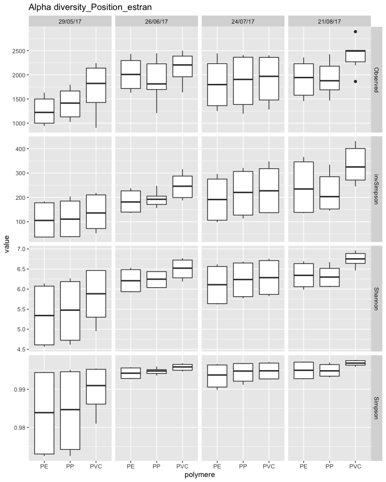
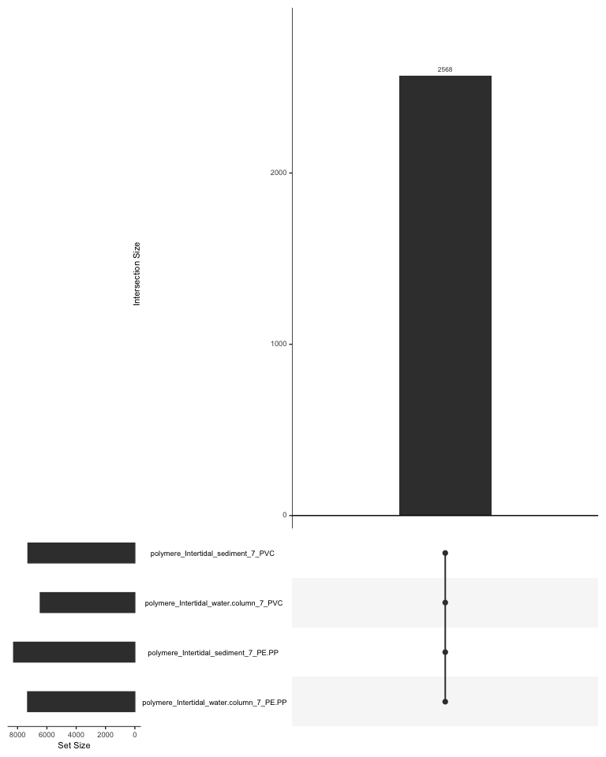
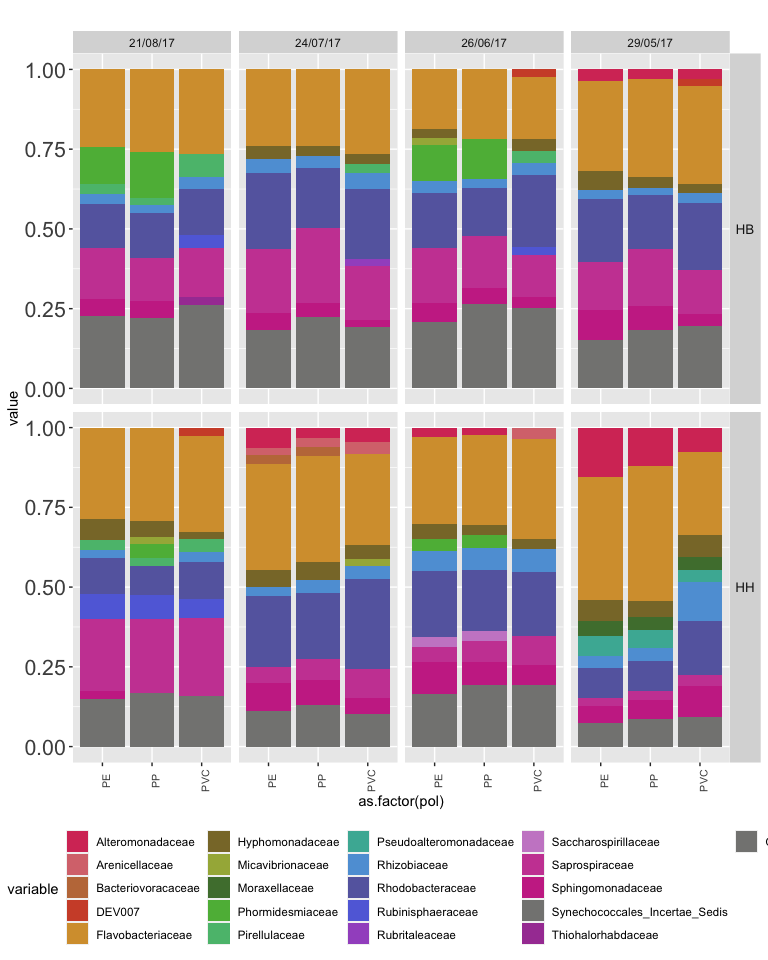
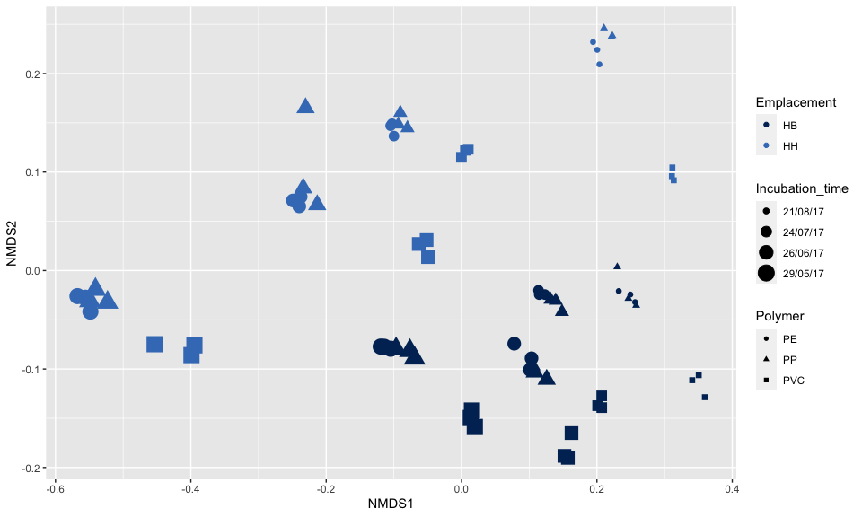
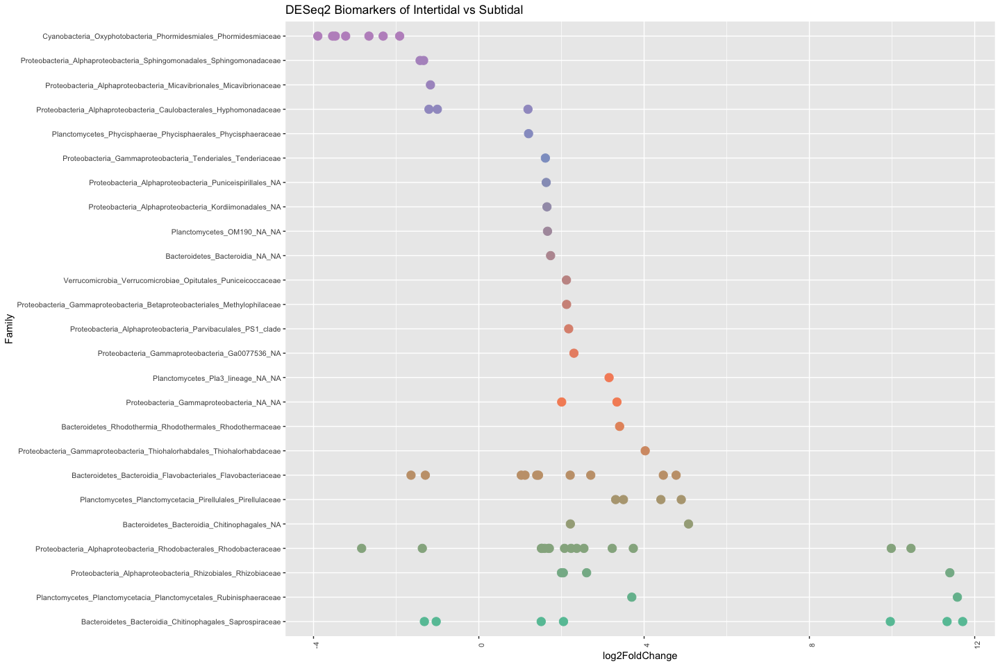
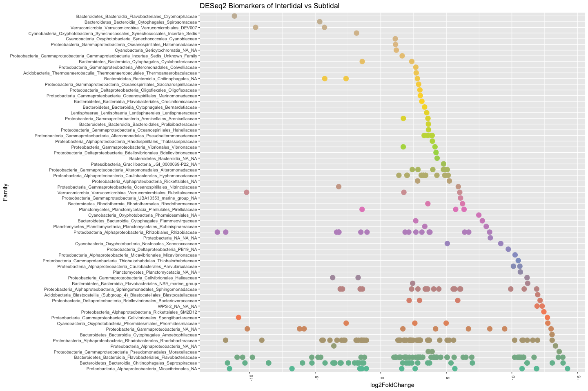
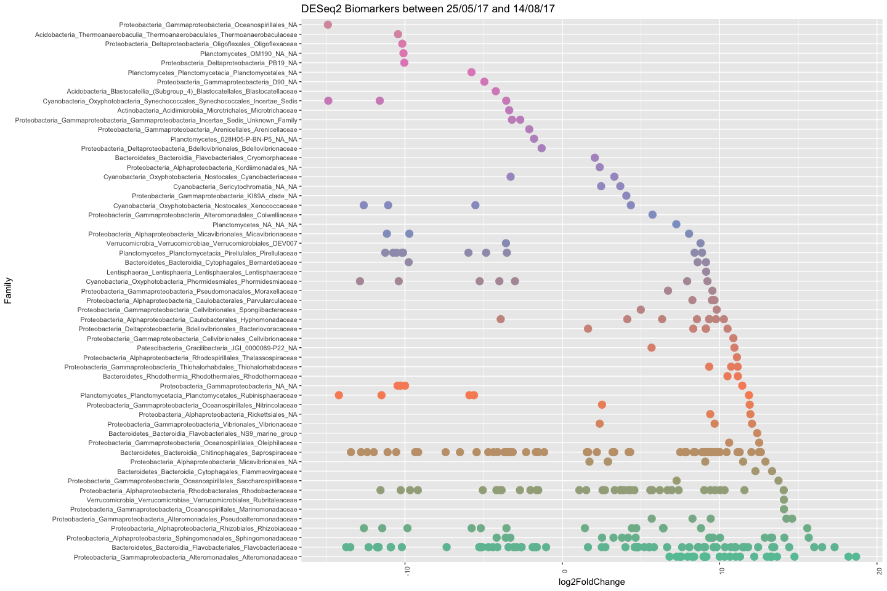

Plastic\_Q4\_f
================

–\> Analysis of early colonizers in the short-term survey

# Prepare tables

# Alpha-diversité short term polymere

``` r
library(phyloseq)
library(reshape2)
library(ggplot2)

alpha <- read.table("Plastic_alpha.txt", header=T, row.names=1)
alpha <- as.data.frame(alpha)
colnames(alpha) <- c("Observed", "invSimpson", "Shannon","Simpson")
alpha <- alpha[order(row.names(alpha)),]

alpha <- alpha[rownames(alpha) %in% rownames(meta),]


alpha$polymere <- meta$Polymere_type
alpha$Date <- meta$Date_collecte


df <- cbind(samples = rownames(alpha), alpha)
df_m <- melt(df, id.vars=c("samples","polymere","Date"))

df_m <- na.omit(df_m)

df_m$Date <- factor(df_m$Date, levels=c("29/05/17","26/06/17","24/07/17","21/08/17"))

p <- ggplot(data=df_m, aes(x=polymere, y=value)) +
  geom_boxplot() +
  facet_grid(variable~Date, scales="free",space="free_x") + ggtitle("Alpha diversity_Position_estran") +
  guides(fill=FALSE)
```



# Shared communities between all conditions tested (Zone, time and polymer) plastics

``` r
library(UpSetR)

meta$condition <- paste(meta$Filter_size, meta$Zone, meta$Emplacement, meta$Jour_.incubation, meta$Polymere,  sep="_")

df <- cbind(samples = rownames(OTU_subset), OTU_subset)
df$condition <- meta$condition
df_m <- melt(df, id.vars=c("samples", "condition"))

mcast <- dcast(df_m, condition ~ variable, sum)
mcastt <- t(mcast)
colnames(mcastt) <- mcastt[1,]
mcastt <- mcastt[-1,]
mcastt <- as.data.frame(mcastt)
#colnames(mcastt) <- c("P_1", "FL_1", "AT_5", "AT_60", "POL")

write.table(mcastt, "mcastt.txt", sep="\t")
mcastt <- read.table("mcastt.txt", header=T, row.names=1)

mcastt[mcastt > 1] <- 1

p2 <- upset(mcastt, 
               keep.order=T, 
               order.by = "freq",
               intersections = list(c("polymere_Intertidal_water.column_7_PE.PP",  "polymere_Intertidal_sediment_7_PE.PP", "polymere_Intertidal_water.column_7_PVC",  "polymere_Intertidal_sediment_7_PVC")))
```



# families distribution

``` r
# Create a matrix table with Families


OTU_t <- as.data.frame(t(otu_subset))

OTU_t$Family = taxtable[match(rownames(OTU_t), rownames(taxtable)),"Family"]

df <- cbind(OTUs = rownames(OTU_t), OTU_t)
df_m <- melt(df, id.vars=c("OTUs", "Family"))
mcast <- dcast(df_m, Family ~ variable, sum)
mcast <- na.omit(mcast)
rownames(mcast) <- mcast$Family
mcast <- mcast[,-1]

meta$condition <- paste(meta$Matrice, meta$Zone, meta$Emplacement, meta$Jour_.incubation, meta$Date_collecte, meta$Polymere_type, sep="_")

otu.perc <- as.data.frame(t(mcast))
otu.perc$condition = meta[match(rownames(otu.perc), rownames(meta)),"condition"]
otu.perc <- cbind(samples = rownames(otu.perc), otu.perc) 

df_m <- melt(otu.perc, id.vars=c("samples", "condition"))
mcast <- dcast(df_m, condition ~ variable, mean)

rownames(mcast) <- mcast$condition
mcast <- mcast[,-1]
otu.perc <- as.data.frame(mcast)

# Families above 1% in sample

sumneg <- function(x) sum(x[x<2])
OTU <- otu.perc
OTU$Other <- apply(OTU,1,sumneg)
m <- OTU
OTU[OTU < 2] <- NA
OTU$Other <- m$Other

df <- cbind(samples = rownames(OTU), OTU)
df$Temps_incubation = meta[match(df$sample, meta$condition),"Date_collecte"]
df$Zone = meta[match(df$sample, meta$condition),"Position_estran"]
df$pol= meta[match(df$sample, meta$condition),"Polymere_type"]


# Keep the 20 most abundant families in the dataset

df_m <- melt(df, id.vars=c("samples","Temps_incubation","Zone","pol"))
df_m <- na.omit(df_m)


col.pal =c("#d63b66","#d8767c","#c17948","#d05034","#d69e3a","#897734","#a5b246","#4e7d3b","#5db746","#5abd7c","#49b4a3","#5fa0d9","#6668ae","#626edc","#a458c8","#ca8acc","#cb4aa2","#ca3493","#848482","#a842a2","#848482")

gg <- ggplot(df_m, aes(x=as.factor(pol), y = value, fill=variable)) +
  geom_bar(stat = "identity", position = "fill") +
  theme(strip.text.y = element_text(size = 10, angle = 0), axis.text.x = element_text(size = 8 , angle = 90), axis.text.y = element_text(size = 16), legend.position="bottom") +
  facet_grid(Zone~Temps_incubation, scales="free", space="free_x") +
  #guides(fill=FALSE) 
  scale_fill_manual(values= col.pal) +
  ggtitle("")
```



# Bray-Curtis dissimilarities for bacterial communities associated to plastics pellets

### NMDS for 7 days PE/PP

``` r
library(vegan)
library(ggplot2)

df <- as.matrix(otu_subset)
#bray <- vegdist(OTU_subset, method="jaccard", binary=T)
bray <- vegdist(OTU_subset, method="bray")
nmds <- metaMDS(bray, wascore = F)

data.score <- as.data.frame(scores(nmds))
data.score$site <- rownames(data.score)

data.score$Emplacement <- meta$Position_estran
data.score$type_incubation <- meta$type_incubation
data.score$Incubation_time <- meta$Date_collecte
data.score$Polymer <- meta$Polymere_type


p1 <- ggplot(data=data.score, aes(x=NMDS1, y=NMDS2, colour = Emplacement)) +
  geom_point(data=data.score, aes(x=NMDS1, y=NMDS2, size=Incubation_time, shape=Polymer)) +
  scale_colour_manual(values=c("#002e63","#417dc1")) 
```



\#PERMANOVA early
incubation

``` r
adonis(formula = otu_subset ~ Polymere + Date_d_ploiement + Emplacement, 
       data = meta,
       permutations = 999, 
       method = "bray", 
       binary = TRUE)
```

    ## 
    ## Call:
    ## adonis(formula = otu_subset ~ Polymere + Date_d_ploiement + Emplacement,      data = meta, permutations = 999, method = "bray", binary = TRUE) 
    ## 
    ## Permutation: free
    ## Number of permutations: 999
    ## 
    ## Terms added sequentially (first to last)
    ## 
    ##                  Df SumsOfSqs MeanSqs F.Model      R2 Pr(>F)    
    ## Polymere          1    0.5173 0.51729  5.4823 0.04109  0.001 ***
    ## Date_d_ploiement  3    3.7927 1.26422 13.3985 0.30125  0.001 ***
    ## Emplacement       1    2.0525 2.05251 21.7529 0.16303  0.001 ***
    ## Residuals        66    6.2275 0.09436         0.49464           
    ## Total            71   12.5899                 1.00000           
    ## ---
    ## Signif. codes:  0 '***' 0.001 '**' 0.01 '*' 0.05 '.' 0.1 ' ' 1

\#Biomarkers of PP/PE vs PVC for all short-incubation polymers

``` r
# Using DESeq2 package

library(DESeq2)
library(phyloseq)
library(ggplot2)
library(reshape2)
library(RColorBrewer)


#Create Phyloseq object
OTU <- otu_table(t(OTU_subset), taxa_are_rows= T)
META <- sample_data(meta)
Phymatrice <- phyloseq(OTU, META)


deseq = phyloseq_to_deseq2(Phymatrice, ~ Polymere)
deseq <- DESeq(deseq)

resLFC <- lfcShrink(deseq, coef="Polymere_PVC_vs_PE.PP", type="apeglm")
resSub <- subset(resLFC, padj < 0.01 & log2FoldChange > 1 | log2FoldChange < -1)


Sub.Pol.short <- as.data.frame(resSub)
Sub.Pol.short <- cbind(taxa = rownames(Sub.Pol.short), Sub.Pol.short)
Sub.Pol.short <- Sub.Pol.short[order(Sub.Pol.short$log2FoldChange, decreasing=F),]
levels <- as.factor(Sub.Pol.short$taxa)
Sub.Pol.short$taxa <- factor(Sub.Pol.short$taxa, levels=levels)

Sub.Pol.short$Family = taxtable[match(Sub.Pol.short$taxa, rownames(taxtable)),"taxa"]
Sub.Pol.short$Genus = taxtable[match(Sub.Pol.short$taxa, rownames(taxtable)),"Genus"]

x = tapply(Sub.Pol.short$log2FoldChange, Sub.Pol.short$Family, function(x) max(x))
x = sort(x, TRUE)
Sub.Pol.short$Family = factor(as.character(Sub.Pol.short$Family), levels=names(x))

col.pal <- brewer.pal(8, "Set2")
col.pal = colorRampPalette(col.pal)(67)


gg <- ggplot(Sub.Pol.short, aes(x=Family, y = log2FoldChange, colour= Family)) + 
  #geom_bar(stat = "identity", position = "stack") +
  geom_point(size=4) +
  theme(strip.text.y = element_text(size = 10, angle = 0), axis.text.x = element_text(size = 8 , angle = 90), axis.text.y = element_text(size = 8), legend.position="none") +
  coord_flip() +
  scale_color_manual(values=col.pal) +
  ggtitle("DESeq2 Biomarkers of Intertidal vs Subtidal")
```

``` r
gg
```



\#Biomarkers of Seawater vs Sediments in intertidal without PVC

``` r
# Using DESeq2 package

library(DESeq2)
library(phyloseq)
library(ggplot2)
library(reshape2)
library(RColorBrewer)


#Create Phyloseq object
OTU <- otu_table(t(OTU_subset), taxa_are_rows= T)
META <- sample_data(meta)
Phymatrice <- phyloseq(OTU, META)

Samples <- subset_samples(Phymatrice, Polymere != "PVC")

deseq = phyloseq_to_deseq2(Samples, ~ Emplacement)
deseq$Zone <- factor(deseq$Zone, levels = c("sediment","water.column"))
deseq <- DESeq(deseq)
resLFC <- lfcShrink(deseq, coef="Emplacement_water.column_vs_sediment", type="apeglm")
resSub <- subset(resLFC, padj < 0.01 & log2FoldChange > 1 | log2FoldChange < -1)

Sub.I <- as.data.frame(resSub)
Sub.I <- cbind(taxa = rownames(Sub.I), Sub.I)
Sub.I <- Sub.I[order(Sub.I$log2FoldChange, decreasing=F),]
levels <- as.factor(Sub.I$taxa)
Sub.I$taxa <- factor(Sub.I$taxa, levels=levels)

Sub.I$Family = taxtable[match(Sub.I$taxa, rownames(taxtable)),"taxa"]
Sub.I$Genus = taxtable[match(Sub.I$taxa, rownames(taxtable)),"Genus"]

x = tapply(Sub.I$log2FoldChange, Sub.I$Family, function(x) max(x))
x = sort(x, TRUE)
Sub.I$Family = factor(as.character(Sub.I$Family), levels=names(x))

col.pal <- brewer.pal(8, "Set2")
col.pal = colorRampPalette(col.pal)(67)

gg <- ggplot(Sub.I, aes(x=Family, y = log2FoldChange, colour= Family)) + 
  #geom_bar(stat = "identity", position = "stack") +
  geom_point(size=4) +
  theme(strip.text.y = element_text(size = 10, angle = 0), axis.text.x = element_text(size = 8 , angle = 90), axis.text.y = element_text(size = 8), legend.position="none") +
  coord_flip() +
  scale_color_manual(values=col.pal) +
  ggtitle("DESeq2 Biomarkers of Intertidal vs Subtidal")
```

``` r
gg
```



\#Biomarkers of the first and last time-point for short-term incubation
polymers

``` r
# Using DESeq2 package

library(DESeq2)
library(phyloseq)
library(ggplot2)
library(reshape2)
library(RColorBrewer)


#Create Phyloseq object
OTU <- otu_table(t(OTU_subset), taxa_are_rows= T)
META <- sample_data(meta)
Phymatrice <- phyloseq(OTU, META)

Samples <- subset_samples(Phymatrice, Polymere != "PVC")
Samples <- subset_samples(Samples, Date_d_ploiement=="22/05/17" | Date_d_ploiement=="14/08/17")

deseq = phyloseq_to_deseq2(Samples, ~ Date_d_ploiement)
#keep <- rowSums(counts(deseq)) >= 2000
#deseq <- deseq[keep,]
deseq$Zone <- factor(deseq$Zone, levels = c("22/05/17","14/08/17"))
#deseq$Matrice <- factor(deseq$Matrice, levels = c("Seawater","Polymere"))
deseq <- DESeq(deseq)

resLFC <- lfcShrink(deseq, coef="Date_d_ploiement_22.05.17_vs_14.08.17", type="apeglm")
#table(resLFC$padj < 0.01)
resSub <- subset(resLFC, padj < 0.01 & log2FoldChange > 1 | log2FoldChange < -1)

Sub.I <- as.data.frame(resSub)
#Sub.I <- Sub.I[rownames(Sub.I) %in% rownames(OTU_abund),]

Sub.I <- cbind(taxa = rownames(Sub.I), Sub.I)

Sub.I <- Sub.I[order(Sub.I$log2FoldChange, decreasing=F),]
#Sub$taxa <- paste("OTU", Sub$taxa , sep="")
levels <- as.factor(Sub.I$taxa)
Sub.I$taxa <- factor(Sub.I$taxa, levels=levels)

Sub.I$Family = taxtable[match(Sub.I$taxa, rownames(taxtable)),"taxa"]
Sub.I$Genus = taxtable[match(Sub.I$taxa, rownames(taxtable)),"Genus"]

x = tapply(Sub.I$log2FoldChange, Sub.I$Family, function(x) max(x))
x = sort(x, TRUE)
Sub.I$Family = factor(as.character(Sub.I$Family), levels=names(x))

col.pal <- brewer.pal(8, "Set2")
col.pal = colorRampPalette(col.pal)(123)


gg <- ggplot(Sub.I, aes(x=Family, y = log2FoldChange, colour= Family)) + 
  #geom_bar(stat = "identity", position = "stack") +
  geom_point(size=4) +
  theme(strip.text.y = element_text(size = 10, angle = 0), axis.text.x = element_text(size = 8 , angle = 90), axis.text.y = element_text(size = 8), legend.position="none") +
  coord_flip() +
  scale_color_manual(values=col.pal) +
  ggtitle("DESeq2 Biomarkers between 25/05/17 and 14/08/17 ")
```

``` r
gg
```


