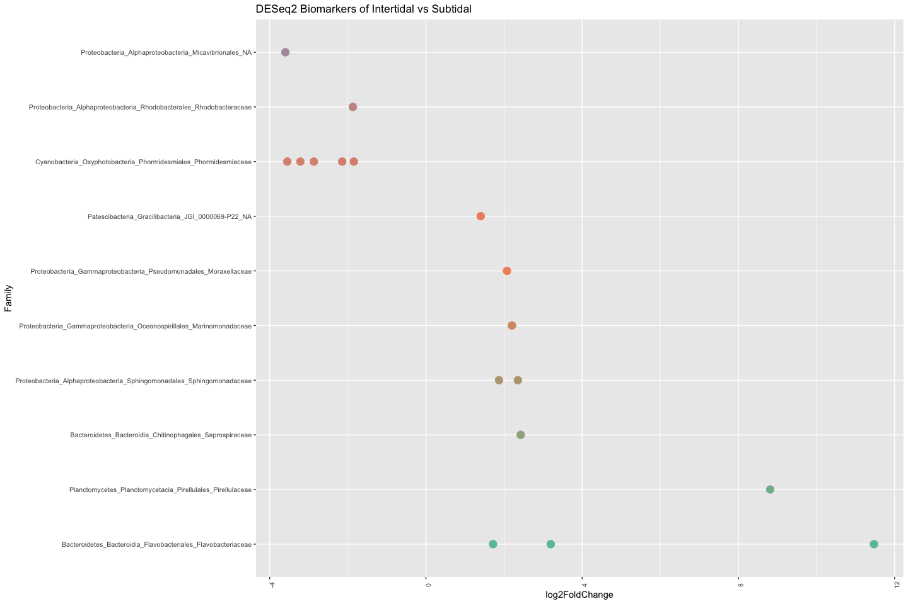
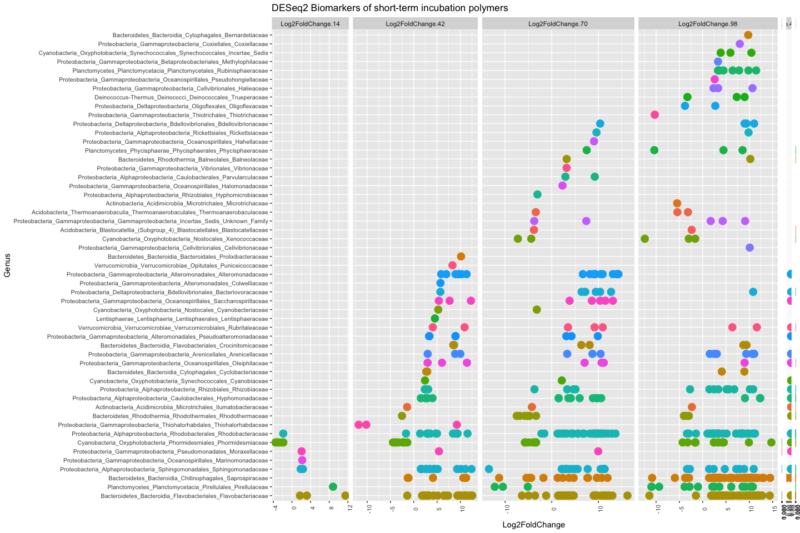
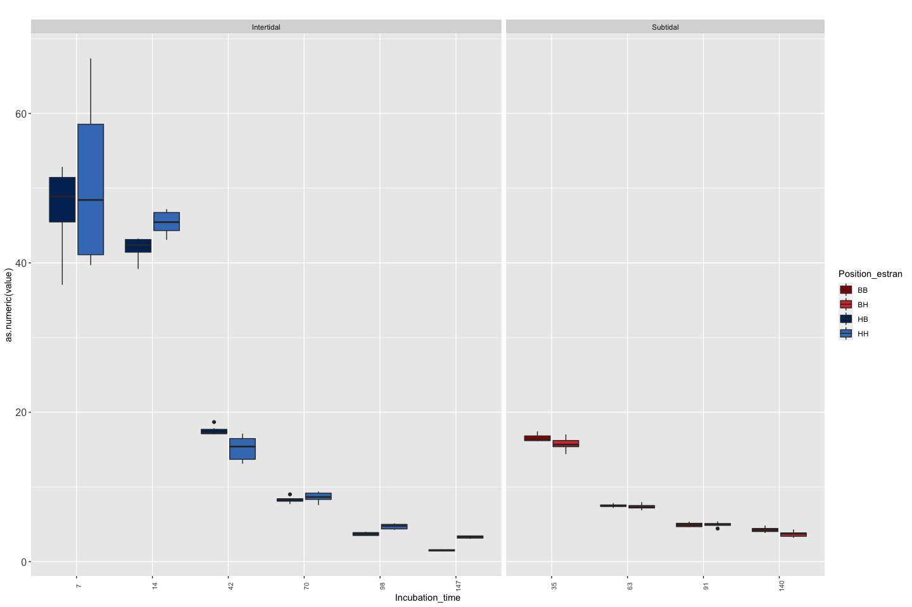
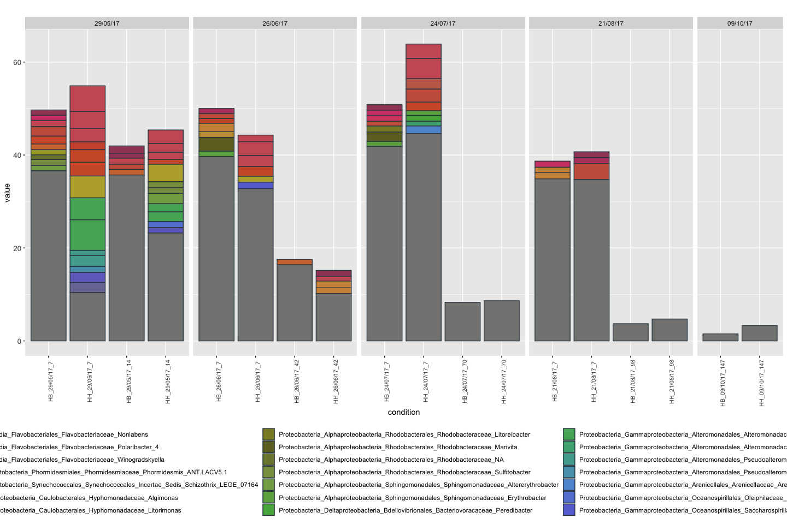
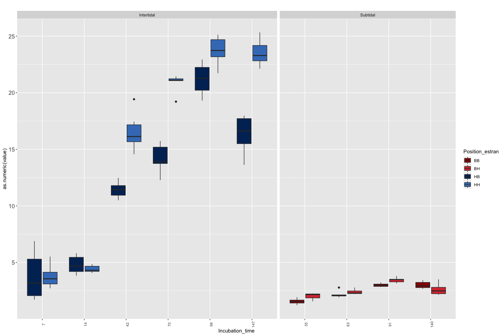
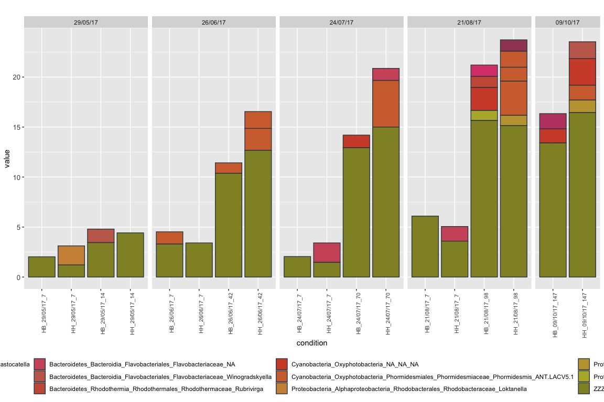
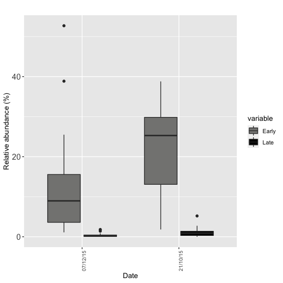
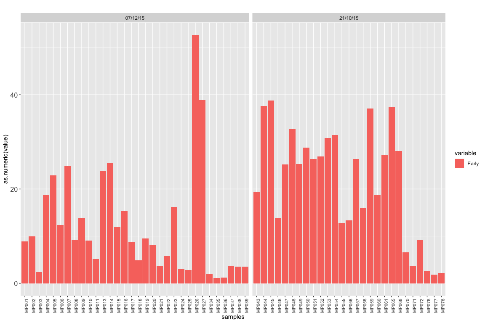
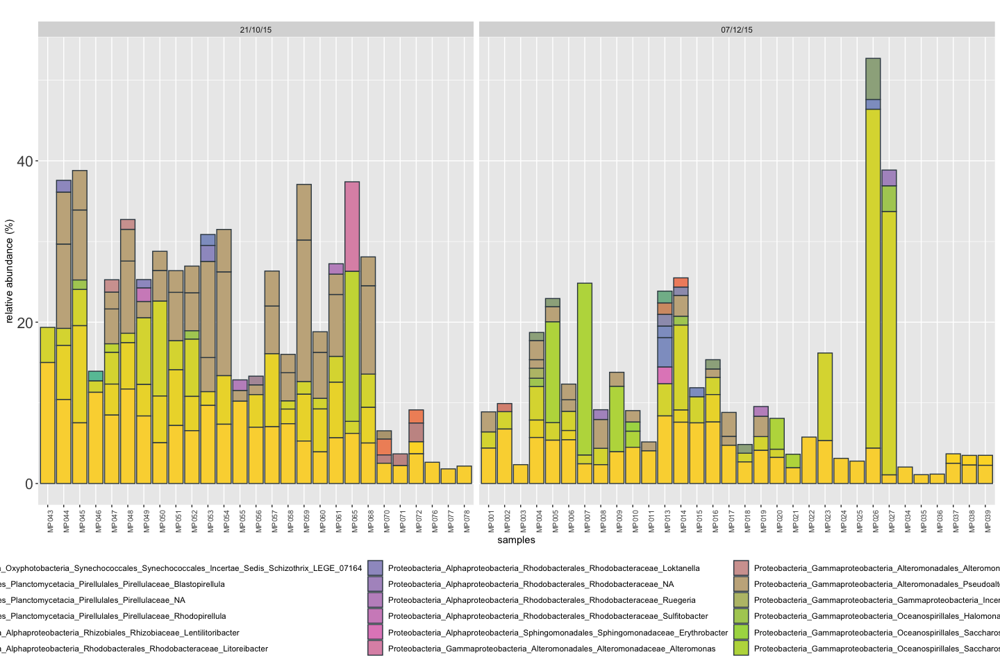
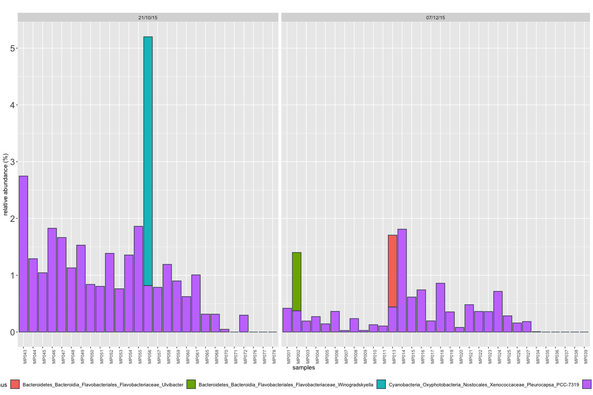

DADA2\_Plastic\_Q5\_f
================

–\> Are they some ASVs specific of young biofilms from short-term (7
days) incubation polymers compare to the long term survey? –\> On
contrary, are they some ASVs specific of elder biofilms?

# Prepare tables

### Biomarkers early incubation 7 vs 14 PEPP

``` r
# Using DESeq2 package

library(DESeq2)
library(phyloseq)
library(ggplot2)
library(reshape2)
library(RColorBrewer)


#Create Phyloseq object
OTU <- otu_table(t(OTU_subset), taxa_are_rows= T)
META <- sample_data(meta)
Phymatrice <- phyloseq(OTU, META)

Samples <- subset_samples(Phymatrice, Polymere !="PVC")
Samples <- subset_samples(Samples, Date_collecte =="29/05/17")

deseq = phyloseq_to_deseq2(Samples, ~ Jour_.incubation)
deseq <- DESeq(deseq)
resLFC <- lfcShrink(deseq, coef="Jour_.incubation_7_vs_14", type="apeglm")
resSub <- subset(resLFC, padj < 0.01 & log2FoldChange > 1 | log2FoldChange < -1)

Sub.14.HH <- as.data.frame(resSub)

Sub.14.HH <- cbind(taxa = rownames(Sub.14.HH), Sub.14.HH)
  
Sub.14.HH <- Sub.14.HH[order(Sub.14.HH$log2FoldChange, decreasing=F),]
levels <- as.factor(Sub.14.HH$taxa)
Sub.14.HH$taxa <- factor(Sub.14.HH$taxa, levels=levels)
Sub.14.HH$Genus = taxtable[match(Sub.14.HH$taxa, rownames(taxtable)),"Genus"]
Sub.14.HH$Family = taxtable[match(Sub.14.HH$taxa, rownames(taxtable)),"taxa"]

x = tapply(Sub.14.HH$log2FoldChange, Sub.14.HH$Family, function(x) max(x))
x = sort(x, TRUE)
Sub.14.HH$Family = factor(as.character(Sub.14.HH$Family), levels=names(x))

col.pal <- brewer.pal(8, "Set2")
col.pal = colorRampPalette(col.pal)(39)

gg <- ggplot(Sub.14.HH, aes(x=Family, y = log2FoldChange, color=Family)) + 
  geom_point(size=4) +
  theme(strip.text.y = element_text(size = 10, angle = 0), axis.text.x = element_text(size = 8 , angle = 90), axis.text.y = element_text(size = 8), legend.position="none") +
  coord_flip() +
  scale_color_manual(values=col.pal) +
  ggtitle("DESeq2 Biomarkers of Intertidal vs Subtidal")
```



### Biomarkers early incubation 7 vs 14 HB PEPP

``` r
# Using DESeq2 package

library(DESeq2)
library(phyloseq)
library(ggplot2)
library(reshape2)
library(RColorBrewer)


#Create Phyloseq object
OTU <- otu_table(t(OTU_subset), taxa_are_rows= T)
META <- sample_data(meta)
Phymatrice <- phyloseq(OTU, META)

Samples <- subset_samples(Phymatrice, Polymere !="PVC")
Samples <- subset_samples(Samples, Date_collecte =="29/05/17")


deseq = phyloseq_to_deseq2(Samples, ~ Jour_.incubation)

deseq <- DESeq(deseq)

resLFC <- lfcShrink(deseq, coef="Jour_.incubation_7_vs_14", type="apeglm")
resSub <- subset(resLFC, padj < 0.01 & log2FoldChange > 1 | log2FoldChange < -1)

Sub.14.HB <- as.data.frame(resSub)

Sub.14.HB <- cbind(taxa = rownames(Sub.14.HB), Sub.14.HB)
#Sub <- Sub[Sub$taxa %in% rownames(OTU_abund),]
  
Sub.14.HB <- Sub.14.HB[order(Sub.14.HB$log2FoldChange, decreasing=F),]
#Sub$taxa <- paste("OTU", Sub$taxa , sep="")
levels <- as.factor(Sub.14.HB$taxa)
Sub.14.HB$taxa <- factor(Sub.14.HB$taxa, levels=levels)
Sub.14.HB$Genus = taxtable[match(Sub.14.HB$taxa, rownames(taxtable)),"Genus"]
Sub.14.HB$Family = taxtable[match(Sub.14.HB$taxa, rownames(taxtable)),"taxa"]
#Sub$color = OTU_a[match(Sub$Genus, OTU_a$Genus),"color"]

x = tapply(Sub.14.HB$log2FoldChange, Sub.14.HB$Family, function(x) max(x))
x = sort(x, TRUE)
Sub.14.HB$Family = factor(as.character(Sub.14.HB$Family), levels=names(x))
```

## Early colonizers of 7 vs 14 for HH and HB

``` r
Sub.14 <- merge(Sub.14.HH, Sub.14.HB, by = "taxa")
```

### Biomarkers early incubation 7 vs 42 HH PEPP

``` r
# Using DESeq2 package

library(DESeq2)
library(phyloseq)
library(ggplot2)
library(reshape2)
library(RColorBrewer)


#Create Phyloseq object
OTU <- otu_table(t(OTU_subset), taxa_are_rows= T)
META <- sample_data(meta)
Phymatrice <- phyloseq(OTU, META)

Samples <- subset_samples(Phymatrice, Polymere !="PVC")
Samples <- subset_samples(Samples, Date_collecte =="26/06/17")


deseq = phyloseq_to_deseq2(Samples, ~ Jour_.incubation)
deseq$Jour_.incubation <- factor(deseq$Jour_.incubation, levels = c("42","7"))
deseq <- DESeq(deseq)

resLFC <- lfcShrink(deseq, coef="Jour_.incubation_7_vs_42", type="apeglm")
resSub <- subset(resLFC, padj < 0.01 & log2FoldChange > 1 | log2FoldChange < -1)

Sub.42.HH <- as.data.frame(resSub)

Sub.42.HH <- cbind(taxa = rownames(Sub.42.HH), Sub.42.HH)
  
Sub.42.HH <- Sub.42.HH[order(Sub.42.HH$log2FoldChange, decreasing=F),]
levels <- as.factor(Sub.42.HH$taxa)
Sub.42.HH$taxa <- factor(Sub.42.HH$taxa, levels=levels)
Sub.42.HH$Genus = taxtable[match(Sub.42.HH$taxa, rownames(taxtable)),"Genus"]
Sub.42.HH$Family = taxtable[match(Sub.42.HH$taxa, rownames(taxtable)),"taxa"]

x = tapply(Sub.42.HH$log2FoldChange, Sub.42.HH$Family, function(x) max(x))
x = sort(x, TRUE)
Sub.42.HH$Family = factor(as.character(Sub.42.HH$Family), levels=names(x))
```

### Biomarkers early incubation 7 vs 42 HB PEPP

``` r
# Using DESeq2 package

library(DESeq2)
library(phyloseq)
library(ggplot2)
library(reshape2)
library(RColorBrewer)


#Create Phyloseq object
OTU <- otu_table(t(OTU_subset), taxa_are_rows= T)
META <- sample_data(meta)
Phymatrice <- phyloseq(OTU, META)

Samples <- subset_samples(Phymatrice, Polymere !="PVC")
Samples <- subset_samples(Samples, Date_collecte =="26/06/17")

deseq = phyloseq_to_deseq2(Samples, ~ Jour_.incubation)
deseq$Jour_.incubation <- factor(deseq$Jour_.incubation, levels = c("42","7"))
deseq <- DESeq(deseq)

resLFC <- lfcShrink(deseq, coef="Jour_.incubation_7_vs_42", type="apeglm")
resSub <- subset(resLFC, padj < 0.01 & log2FoldChange > 1 | log2FoldChange < -1)

Sub.42.HB <- as.data.frame(resSub)

Sub.42.HB <- cbind(taxa = rownames(Sub.42.HB), Sub.42.HB)
  
Sub.42.HB <- Sub.42.HB[order(Sub.42.HB$log2FoldChange, decreasing=F),]
levels <- as.factor(Sub.42.HB$taxa)
Sub.42.HB$taxa <- factor(Sub.42.HB$taxa, levels=levels)
Sub.42.HB$Genus = taxtable[match(Sub.42.HB$taxa, rownames(taxtable)),"Genus"]
Sub.42.HB$Family = taxtable[match(Sub.42.HB$taxa, rownames(taxtable)),"taxa"]

x = tapply(Sub.42.HB$log2FoldChange, Sub.42.HB$Family, function(x) max(x))
x = sort(x, TRUE)
Sub.42.HB$Family = factor(as.character(Sub.42.HB$Family), levels=names(x))
```

## Early colonizers of 7 vs 42 for HH and HB

``` r
Sub.42 <- merge(Sub.42.HH, Sub.42.HB, by = "taxa")
```

### Biomarkers early incubation 7 vs 70 HH PEPP

``` r
# Using DESeq2 package

library(DESeq2)
library(phyloseq)
library(ggplot2)
library(reshape2)
library(RColorBrewer)


#Create Phyloseq object
OTU <- otu_table(t(OTU_subset), taxa_are_rows= T)
META <- sample_data(meta)
Phymatrice <- phyloseq(OTU, META)

Samples <- subset_samples(Phymatrice, Polymere !="PVC")
Samples <- subset_samples(Samples, Date_collecte =="24/07/17")

deseq = phyloseq_to_deseq2(Samples, ~ Jour_.incubation)

deseq <- DESeq(deseq)

deseq$Jour_.incubation <- factor(deseq$Jour_.incubation, levels = c("70","7"))
resLFC <- lfcShrink(deseq, coef="Jour_.incubation_70_vs_7", type="apeglm")
resSub <- subset(resLFC, padj < 0.01 & log2FoldChange > 1 | log2FoldChange < -1)

Sub.70.HH <- as.data.frame(resSub)

Sub.70.HH <- cbind(taxa = rownames(Sub.70.HH), Sub.70.HH)
  
Sub.70.HH <- Sub.70.HH[order(Sub.70.HH$log2FoldChange, decreasing=F),]
levels <- as.factor(Sub.70.HH$taxa)
Sub.70.HH$taxa <- factor(Sub.70.HH$taxa, levels=levels)
Sub.70.HH$Genus = taxtable[match(Sub.70.HH$taxa, rownames(taxtable)),"Genus"]
Sub.70.HH$Family = taxtable[match(Sub.70.HH$taxa, rownames(taxtable)),"taxa"]

x = tapply(Sub.70.HH$log2FoldChange, Sub.70.HH$Family, function(x) max(x))
x = sort(x, TRUE)
Sub.70.HH$Family = factor(as.character(Sub.70.HH$Family), levels=names(x))
```

### Biomarkers early incubation 7 vs 70 HB

``` r
# Using DESeq2 package

library(DESeq2)
library(phyloseq)
library(ggplot2)
library(reshape2)
library(RColorBrewer)


#Create Phyloseq object
OTU <- otu_table(t(OTU_subset), taxa_are_rows= T)
META <- sample_data(meta)
Phymatrice <- phyloseq(OTU, META)

Samples <- subset_samples(Phymatrice, Polymere !="PVC")
Samples <- subset_samples(Samples, Date_collecte =="24/07/17")


deseq = phyloseq_to_deseq2(Samples, ~ Jour_.incubation)

deseq <- DESeq(deseq)

deseq$Jour_.incubation <- factor(deseq$Jour_.incubation, levels = c("70","7"))
resLFC <- lfcShrink(deseq, coef="Jour_.incubation_70_vs_7", type="apeglm")
resSub <- subset(resLFC, padj < 0.01 & log2FoldChange > 1 | log2FoldChange < -1)

Sub.70.HB <- as.data.frame(resSub)

Sub.70.HB <- cbind(taxa = rownames(Sub.70.HB), Sub.70.HB)
  
Sub.70.HB <- Sub.70.HB[order(Sub.70.HB$log2FoldChange, decreasing=F),]
levels <- as.factor(Sub.70.HB$taxa)
Sub.70.HB$taxa <- factor(Sub.70.HB$taxa, levels=levels)
Sub.70.HB$Genus = taxtable[match(Sub.70.HB$taxa, rownames(taxtable)),"Genus"]
Sub.70.HB$Family = taxtable[match(Sub.70.HB$taxa, rownames(taxtable)),"taxa"]

x = tapply(Sub.70.HB$log2FoldChange, Sub.70.HB$Family, function(x) max(x))
x = sort(x, TRUE)
Sub.70.HB$Family = factor(as.character(Sub.70.HB$Family), levels=names(x))
```

## Early colonizers of 7 vs 70 for HH and HB

``` r
Sub.70 <- merge(Sub.70.HH, Sub.70.HB, by = "taxa")
```

### Biomarkers early incubation 7 vs 98 HH PEPP

``` r
# Using DESeq2 package

library(DESeq2)
library(phyloseq)
library(ggplot2)
library(reshape2)
library(RColorBrewer)


#Create Phyloseq object
OTU <- otu_table(t(OTU_subset), taxa_are_rows= T)
META <- sample_data(meta)
Phymatrice <- phyloseq(OTU, META)

Samples <- subset_samples(Phymatrice, Polymere !="PVC")
Samples <- subset_samples(Samples, Date_collecte =="21/08/17")


deseq = phyloseq_to_deseq2(Samples, ~ Jour_.incubation)

deseq <- DESeq(deseq)

deseq$Jour_.incubation <- factor(deseq$Jour_.incubation, levels = c("98","7"))
resLFC <- lfcShrink(deseq, coef="Jour_.incubation_98_vs_7", type="apeglm")
resSub <- subset(resLFC, padj < 0.01 & log2FoldChange > 1 | log2FoldChange < -1)

Sub.98.HH <- as.data.frame(resSub)

Sub.98.HH <- cbind(taxa = rownames(Sub.98.HH), Sub.98.HH)
  
Sub.98.HH <- Sub.98.HH[order(Sub.98.HH$log2FoldChange, decreasing=F),]
levels <- as.factor(Sub.98.HH$taxa)
Sub.98.HH$taxa <- factor(Sub.98.HH$taxa, levels=levels)
Sub.98.HH$Genus = taxtable[match(Sub.98.HH$taxa, rownames(taxtable)),"Genus"]
Sub.98.HH$Family = taxtable[match(Sub.98.HH$taxa, rownames(taxtable)),"taxa"]


x = tapply(Sub.98.HH$log2FoldChange, Sub.98.HH$Family, function(x) max(x))
x = sort(x, TRUE)
Sub.98.HH$Family = factor(as.character(Sub.98.HH$Family), levels=names(x))
```

### Biomarkers early incubation 7 vs 98 HB

``` r
# Using DESeq2 package

library(DESeq2)
library(phyloseq)
library(ggplot2)
library(reshape2)
library(RColorBrewer)


#Create Phyloseq object
OTU <- otu_table(t(OTU_subset), taxa_are_rows= T)
META <- sample_data(meta)
Phymatrice <- phyloseq(OTU, META)

Samples <- subset_samples(Phymatrice, Polymere !="PVC")
Samples <- subset_samples(Samples, Date_collecte =="21/08/17")


deseq = phyloseq_to_deseq2(Samples, ~ Jour_.incubation)

deseq <- DESeq(deseq)

deseq$Jour_.incubation <- factor(deseq$Jour_.incubation, levels = c("98","7"))
resLFC <- lfcShrink(deseq, coef="Jour_.incubation_98_vs_7", type="apeglm")
resSub <- subset(resLFC, padj < 0.01 & log2FoldChange > 1 | log2FoldChange < -1)

Sub.98.HB <- as.data.frame(resSub)

Sub.98.HB <- cbind(taxa = rownames(Sub.98.HB), Sub.98.HB)
  
Sub.98.HB <- Sub.98.HB[order(Sub.98.HB$log2FoldChange, decreasing=F),]
levels <- as.factor(Sub.98.HB$taxa)
Sub.98.HB$taxa <- factor(Sub.98.HB$taxa, levels=levels)
Sub.98.HB$Genus = taxtable[match(Sub.98.HB$taxa, rownames(taxtable)),"Genus"]
Sub.98.HB$Family = taxtable[match(Sub.98.HB$taxa, rownames(taxtable)),"taxa"]

x = tapply(Sub.98.HB$log2FoldChange, Sub.98.HB$Family, function(x) max(x))
x = sort(x, TRUE)
Sub.98.HB$Family = factor(as.character(Sub.98.HB$Family), levels=names(x))
```

## Early colonizers of 7 vs 98 for HH and HB

``` r
Sub.98 <- merge(Sub.98.HH, Sub.98.HB, by = "taxa")
```

\#Combine biomarkers in a single plot

``` r
Sub.14 <- Sub.14[,c(1,3)]
colnames(Sub.14) <- c("taxa","Log2FoldChange.14")
Sub.42 <- Sub.42[,c(1,3)]
colnames(Sub.42) <- c("taxa","Log2FoldChange.42")
Sub.70 <- Sub.70[,c(1,3)]
colnames(Sub.70) <- c("taxa","Log2FoldChange.70")
Sub.98 <- Sub.98[,c(1,3)]
colnames(Sub.98) <- c("taxa","Log2FoldChange.98")

Sub.1 <- merge(Sub.14, Sub.42, by="taxa", all=T)
Sub.2 <- merge(Sub.1, Sub.70, by="taxa", all=T)
Sub.3 <- merge(Sub.2, Sub.98, by="taxa", all=T)

Sub <- Sub.3

Sub$comp.14.42 <- sign(Sub$Log2FoldChange.14) == sign(Sub$Log2FoldChange.42) 
Sub$comp.42.70 <- sign(Sub$Log2FoldChange.42) == sign(Sub$Log2FoldChange.70) 
Sub$comp.70.98 <- sign(Sub$Log2FoldChange.70) == sign(Sub$Log2FoldChange.98)

#Sub <- Sub[-c(1,2),]


### Keep only genus with ASVs that are found strictly early or late colonizers

S <- Sub
S[is.na(S)] <- 0
row.names(S) <- S$taxa
S <- S[,-1]
S[S >= 1 ] <- "P"
S[S < 0 ] <- "N"

S <- as.data.frame(S)

S$Neg_L2FC <- rowSums(S[,c("Log2FoldChange.42","Log2FoldChange.70","Log2FoldChange.98")] == "N")
S$Pos_L2FC <- rowSums(S[,c("Log2FoldChange.42","Log2FoldChange.70","Log2FoldChange.98")] == "P")

SubEarlyLate <- S[,-c(1:3)]

taxtable <- read.table("DADA2_Plastic_OTU_tax.txt", header=T, row.names=1, sep="\t")
taxtable <- as.data.frame(taxtable)
taxtable$taxa <- paste(taxtable$Phylum,taxtable$Class,taxtable$Order, taxtable$Family, sep="_")

SubEarlyLate$Genus = taxtable[match(rownames(SubEarlyLate), rownames(taxtable)),"taxa"]
SubEarlyLate$taxa <- rownames(SubEarlyLate)
Sub_melt <- melt(SubEarlyLate, id.vars= c("Genus","taxa"))


mcastEarly <- subset(SubEarlyLate, Neg_L2FC == 0)

mcastLate <- subset(SubEarlyLate, Pos_L2FC == 0)

mcastEarly <- mcastEarly[!mcastEarly$taxa %in% mcastLate$taxa,]
mcastLate <- mcastLate[!mcastLate$taxa %in% mcastEarly$taxa,]

Sub <- Sub[order(Sub$Log2FoldChange.14, decreasing=T),]

Sub$Genus = taxtable[match(Sub$taxa, rownames(taxtable)),"Genus"]
Sub$Family = taxtable[match(Sub$taxa, rownames(taxtable)),"taxa"]
levels <- as.factor(Sub$Family)

Sub_m <- melt(Sub, id.vars=c("taxa","Genus","Family"))
Sub_m <- na.omit(Sub_m)


col.pal = colorRampPalette(col.pal)(167)

gg <- ggplot(Sub_m, aes(x=factor(Family, levels=unique(levels)), y = value)) + 
  #geom_bar(stat = "identity", position = "stack") +
  geom_point(aes(size=3, color=Family)) +
  theme(strip.text.y = element_text(size = 10, angle = 0), axis.text.x = element_text(size = 8 , angle = 90), axis.text.y = element_text(size = 8), legend.position="none") +
  labs(title="DESeq2 Biomarkers of short-term incubation polymers",
        x ="Genus", y = "Log2FoldChange") +
  coord_flip() +
  facet_grid(.~variable, scales="free", space="free_x") 
  scale_color_manual(values= col.pal) 
```

    ## <ggproto object: Class ScaleDiscrete, Scale, gg>
    ##     aesthetics: colour
    ##     axis_order: function
    ##     break_info: function
    ##     break_positions: function
    ##     breaks: waiver
    ##     call: call
    ##     clone: function
    ##     dimension: function
    ##     drop: TRUE
    ##     expand: waiver
    ##     get_breaks: function
    ##     get_breaks_minor: function
    ##     get_labels: function
    ##     get_limits: function
    ##     guide: legend
    ##     is_discrete: function
    ##     is_empty: function
    ##     labels: waiver
    ##     limits: NULL
    ##     make_sec_title: function
    ##     make_title: function
    ##     map: function
    ##     map_df: function
    ##     n.breaks.cache: NULL
    ##     na.translate: TRUE
    ##     na.value: grey50
    ##     name: waiver
    ##     palette: function
    ##     palette.cache: NULL
    ##     position: left
    ##     range: <ggproto object: Class RangeDiscrete, Range, gg>
    ##         range: NULL
    ##         reset: function
    ##         train: function
    ##         super:  <ggproto object: Class RangeDiscrete, Range, gg>
    ##     rescale: function
    ##     reset: function
    ##     scale_name: manual
    ##     train: function
    ##     train_df: function
    ##     transform: function
    ##     transform_df: function
    ##     super:  <ggproto object: Class ScaleDiscrete, Scale, gg>



# Prepare tables

``` r
# Metadata for the long-term survey
metadata <- read.csv("metadata_Meta_plastic.csv", header=T, row.names=1, sep=";")
meta <- subset(metadata, Type_sample == "sample")
meta$meta <- paste(meta$Emplacement, meta$Date_collecte,  meta$Polymere_type,  sep="_")
meta$condition <- paste(meta$Position_estran, meta$Date_collecte, meta$Jour_.incubation,  sep="_")
meta <- meta[ order(row.names(meta)), ]

# OTU table for the long-term survey

OTU <- read.table("DADA2_Plastic_OTU_table.txt", header=T, row.names=1)
colnames(OTU) <- gsub('X','', colnames(OTU))
OTU_subset <- OTU[,colnames(OTU) %in% rownames(meta)]
OTU_subset <- OTU_subset[apply(OTU_subset[,], 1, function(x) !all(x==0)),]
OTU_subset <- as.data.frame(t(OTU_subset))
OTU_subset <- OTU_subset[ order(row.names(OTU_subset)), ]

# OTU table percent for the long-term survey

otu <- read.table("DADA2_Plastic_OTU_percent.txt", header=T, row.names=1)
colnames(otu) <- gsub('X','', colnames(otu))
otu_subset <- otu[,colnames(otu) %in% rownames(meta)]
otu_subset <- otu_subset[apply(otu_subset[,], 1, function(x) !all(x==0)),]
otu_subset <- as.data.frame(t(otu_subset))
otu_subset <- otu_subset[ order(row.names(otu_subset)), ]

# Taxtable

taxtable <- read.table("DADA2_Plastic_OTU_tax.txt", header=T, row.names=1, sep="\t")
taxtable <- as.data.frame(taxtable)
taxtable$taxa <- paste(taxtable$Phylum,taxtable$Class,taxtable$Order, taxtable$Family, taxtable$Genus, sep="_")

# Table early-late

table_perc <- as.data.frame(otu_subset)

Table_early_late <- data.frame(
  Early = apply(table_perc[,colnames(table_perc) %in% rownames(mcastEarly)], 1, sum),
  Late = apply(table_perc[,colnames(table_perc) %in% rownames(mcastLate)], 1, sum)
  )
```

# Distribution early microrevenge

``` r
# Create a table with early and late colonizers


meta_spe <- subset(meta, Dataset == "microrevenge")
meta_spe <- subset(meta_spe, Matrice == "Polymere")
meta_spe <- subset(meta_spe, Polymere != "PVC")
meta_spe <- subset(meta_spe, type_incubation != "longue_courte")

df <- Table_early_late[rownames(Table_early_late) %in% rownames(meta_spe),]

df <- cbind(samples = rownames(df), df)
df$Incubation_time = meta[match(df$samples, rownames(meta)),"Jour_.incubation"]
df$Zone = meta[match(df$samples, rownames(meta)),"Zone"]
df$Position_estran = meta[match(df$samples, rownames(meta)),"Position_estran"]
dfm <- melt(df, id.vars=c("samples","Zone","Position_estran","Incubation_time"))
dfm <- na.omit(dfm)


dfm$Incubation_time <- factor(dfm$Incubation_time, levels=c("7","14","35","42","56","63","70","91","98","140","147"))


gg <- ggplot(subset(dfm, variable=="Early"), aes(x = Incubation_time, y = as.numeric(value), fill=Position_estran)) +
  geom_boxplot() +
  theme(strip.text.y = element_text(size = 10, angle = 0), axis.text.x = element_text(size = 8 , angle = 90), axis.text.y = element_text(size = 12), legend.position="right") +
  #scale_y_continuous(limits=c(0,30)) +
  facet_grid(.~Zone, scales="free", space="free_x") +
  #guides(fill=FALSE) 
  scale_fill_manual(values=c("#990000","#d73b3e","#002e63","#417dc1")) +
  ggtitle("")
```



# Plot biomarkers Intertidal genus Microrevenge Court

``` r
meta_spe <- subset(meta_spe, Zone == "Intertidal")

df <- otu_subset[rownames(otu_subset) %in% rownames(meta_spe),]

otu.perc <- df[,colnames(df) %in% mcastEarly$taxa]
otu.perc$condition = meta_spe[match(rownames(otu.perc), rownames(meta_spe)),"condition"]
otu.perc <- cbind(samples = rownames(otu.perc), otu.perc) 
df_m <- melt(otu.perc, id.vars=c("samples", "condition"))
mcast <- dcast(df_m, condition ~ variable, mean)
rownames(mcast) <- mcast$condition
mcast <- mcast[,-1]


sumneg <- function(x) sum(x[x<1])
write.table (mcast, "OTU_subset.txt", sep="\t")
OTU <- read.table("OTU_subset.txt", header=1, row.names=1)
OTU <- as.data.frame(OTU)
OTU$Other <- apply(OTU,1,sumneg)
m <- OTU
OTU[OTU < 1] <- NA
OTU$Other <- m$Other

otu.perc <- as.data.frame(OTU)


otu.perc$condition <- rownames(otu.perc)
mcast <- melt(otu.perc)
mcast <- as.data.frame(mcast)

#df <- cbind(samples = rownames(otu.perc), otu.perc)
mcast$Date_collecte = meta[match(mcast$condition, meta$condition),"Date_collecte"]
mcast$Zone = meta[match(mcast$condition, meta$condition),"Zone"]
mcast$Time= meta[match(mcast$condition, meta$condition),"Jour_.incubation"]
mcast$Genus = taxtable[match(mcast$variable, rownames(taxtable)),"taxa"]

mcast$Genus <- ifelse(mcast$variable =="Other", "ZZZ_Other", as.character(mcast$Genus))
mcast$Genus <- ifelse(is.na(mcast$Genus), "ZZ_Unknown", as.character(mcast$Genus))


mcast <- na.omit(mcast)

col.pal = c("#a24765","#db467a","#c46b5a","#d24f34","#d09145","#b5b336","#6e6e29","#8fa859","#55b04a","#4bae8f","#5f98d5","#6c6ad8","#848482")

mcast$Date_collecte <- factor(mcast$Date_collecte, levels=c("29/05/17","26/06/17","24/07/17","21/08/17","09/10/17"))

mcast$condition <- factor(mcast$condition, levels=c("HB_29/05/17_7","HH_29/05/17_7","HB_29/05/17_14","HH_29/05/17_14","HB_26/06/17_7","HH_26/06/17_7","HB_26/06/17_42","HH_26/06/17_42","HB_24/07/17_7","HH_24/07/17_7","HB_24/07/17_70","HH_24/07/17_70","HB_21/08/17_7","HH_21/08/17_7","HB_21/08/17_98","HH_21/08/17_98","HB_09/10/17_147","HH_09/10/17_147","BB_26/06/17_35","BH_26/06/17_35","BB_24/07/17_63","BH_24/07/17_63","BB_21/08/17_91","BH_21/08/17_91","BB_09/10/17_140","BH_09/10/17_140"))

col.pal = colorRampPalette(col.pal)(31)
gg <- ggplot(mcast, aes(x=condition, y = value, fill=Genus)) +
  geom_bar(stat = "identity", position = "stack", color= "#36454f") +
  #geom_errorbar(aes(ymin= value - sd, ymax= value +sd),
                #width=.2,                
                #position="dodge") +
  theme(strip.text.y = element_text(size = 10, angle = 0), axis.text.x = element_text(size = 8 , angle = 90), axis.text.y = element_text(size = 10), legend.position="bottom") +
  facet_grid(.~Date_collecte, scales="free", space="free_x") +
  scale_fill_manual(values= col.pal) +
  ggtitle("")
```



# Distribution late microrevenge

``` r
gg <- ggplot(subset(dfm, variable=="Late"), aes(x = Incubation_time, y = as.numeric(value), fill=Position_estran)) +
  geom_boxplot() +
  theme(strip.text.y = element_text(size = 10, angle = 0), axis.text.x = element_text(size = 8 , angle = 90), axis.text.y = element_text(size = 12), legend.position="right") +
  #scale_y_continuous(limits=c(0,30)) +
  facet_grid(.~Zone, scales="free", space="free_x") +
  #guides(fill=FALSE) 
  scale_fill_manual(values=c("#990000","#d73b3e","#002e63","#417dc1")) +
  ggtitle("")
```



# Plot biomarkers Intertidal genus Microrevenge Long

``` r
meta_spe <- subset(meta_spe, Zone == "Intertidal")

df <- otu_subset[rownames(otu_subset) %in% rownames(meta_spe),]

otu.perc <- df[,colnames(df) %in% mcastLate$taxa]
otu.perc$condition = meta_spe[match(rownames(otu.perc), rownames(meta_spe)),"condition"]
otu.perc <- cbind(samples = rownames(otu.perc), otu.perc) 
df_m <- melt(otu.perc, id.vars=c("samples", "condition"))
mcast <- dcast(df_m, condition ~ variable, mean)
rownames(mcast) <- mcast$condition
mcast <- mcast[,-1]


sumneg <- function(x) sum(x[x<1])
write.table (mcast, "OTU_subset.txt", sep="\t")
OTU <- read.table("OTU_subset.txt", header=1, row.names=1)
OTU <- as.data.frame(OTU)
OTU$Other <- apply(OTU,1,sumneg)
m <- OTU
OTU[OTU < 1] <- NA
OTU$Other <- m$Other

otu.perc <- as.data.frame(OTU)

#rownames(mcast) <- mcast$condition

#mcast <- mcast[,-1]

otu.perc$condition <- rownames(otu.perc)
mcast <- melt(otu.perc)
mcast <- as.data.frame(mcast)

#df <- cbind(samples = rownames(otu.perc), otu.perc)
mcast$Date_collecte = meta[match(mcast$condition, meta$condition),"Date_collecte"]
mcast$Zone = meta[match(mcast$condition, meta$condition),"Zone"]
mcast$Time= meta[match(mcast$condition, meta$condition),"Jour_.incubation"]
mcast$Genus = taxtable[match(mcast$variable, rownames(taxtable)),"taxa"]

mcast$Genus <- ifelse(mcast$variable =="Other", "ZZZ_Other", as.character(mcast$Genus))
mcast$Genus <- ifelse(is.na(mcast$Genus), "ZZ_Unknown", as.character(mcast$Genus))


mcast <- na.omit(mcast)

col.pal = c("#a24765","#db467a","#c46b5a","#d24f34","#d09145","#b5b336","#6e6e29","#8fa859","#55b04a","#4bae8f","#5f98d5","#6c6ad8","#848482")

mcast$Date_collecte <- factor(mcast$Date_collecte, levels=c("29/05/17","26/06/17","24/07/17","21/08/17","09/10/17"))

mcast$condition <- factor(mcast$condition, levels=c("HB_29/05/17_7","HH_29/05/17_7","HB_29/05/17_14","HH_29/05/17_14","HB_26/06/17_7","HH_26/06/17_7","HB_26/06/17_42","HH_26/06/17_42","HB_24/07/17_7","HH_24/07/17_7","HB_24/07/17_70","HH_24/07/17_70","HB_21/08/17_7","HH_21/08/17_7","HB_21/08/17_98","HH_21/08/17_98","HB_09/10/17_147","HH_09/10/17_147","BB_26/06/17_35","BH_26/06/17_35","BB_24/07/17_63","BH_24/07/17_63","BB_21/08/17_91","BH_21/08/17_91","BB_09/10/17_140","BH_09/10/17_140"))

col.pal = colorRampPalette(col.pal)(25)
gg <- ggplot(mcast, aes(x=condition, y = value, fill=Genus)) +
  geom_bar(stat = "identity", position = "stack", color= "#36454f") +
  #geom_errorbar(aes(ymin= value - sd, ymax= value +sd),
                #width=.2,                
                #position="dodge") +
  theme(strip.text.y = element_text(size = 10, angle = 0), axis.text.x = element_text(size = 8 , angle = 90), axis.text.y = element_text(size = 10), legend.position="bottom") +
  facet_grid(.~Date_collecte, scales="free", space="free_x") +
  scale_fill_manual(values= col.pal) +
  ggtitle("")

gg
```

<!-- -->

# Distribution early-late laura dataset

``` r
meta_spe <- subset(meta, Dataset == "laura_dataset")
meta_spe <- subset(meta_spe, Type_sample == "sample")

df <- Table_early_late[rownames(Table_early_late) %in% rownames(meta_spe),]

df <- cbind(samples = rownames(df), df)
df$Date <- meta[match(df$samples, rownames(meta)),"Date_collecte"]
df_m <- melt(df, id.vars=c("samples","Date"))
df_m <- na.omit(df_m)


gg <- ggplot(df_m, aes(x = Date, y = as.numeric(value), fill=variable)) +
  #geom_bar(stat = "identity", position = "stack") +
  geom_boxplot() +
  theme(strip.text.y = element_text(size = 10, angle = 0), axis.text.x = element_text(size = 8 , angle = 90), axis.text.y = element_text(size = 12), legend.position="right") +
  #scale_y_continuous(limits=c(0,30)) +
  #facet_grid(.~Date, scales="free", space="free_x") +
  #guides(fill=FALSE) 
  scale_fill_manual(values= c("#848482","#000000")) +
  ylab("Relative abundance (%)") +
  ggtitle("")
```

``` r
gg
```



# Distribution early laura dataset

``` r
gg <- ggplot(subset(df_m, variable=="Early"), aes(x = samples, y = as.numeric(value), fill=variable)) +
  geom_bar(stat = "identity", position = "dodge") +
  #geom_boxplot() +
  theme(strip.text.y = element_text(size = 10, angle = 0), axis.text.x = element_text(size = 8 , angle = 90), axis.text.y = element_text(size = 12), legend.position="right") +
  #scale_y_continuous(limits=c(0,30)) +
  facet_grid(.~Date, scales="free", space="free_x") +
  #guides(fill=FALSE) 
  #scale_fill_manual(values= c("#962938","#cb4154","#6a6a69","#91918f")) +
  ggtitle("")

gg
```

<!-- -->

# Plot biomarkers Intertidal genus/ASV Laura dataset

``` r
df <- otu_subset[rownames(otu_subset) %in% rownames(meta_spe),]

otu.perc <- df[,colnames(df) %in% mcastEarly$taxa]


sumneg <- function(x) sum(x[x<1])
write.table (otu.perc, "OTU_subset.txt", sep="\t")
OTU <- read.table("OTU_subset.txt", header=1, row.names=1)
OTU <- as.data.frame(OTU)
OTU$Other <- apply(OTU,1,sumneg)
m <- OTU
OTU[OTU < 1] <- NA
OTU$Other <- m$Other


otu.perc <- as.data.frame(OTU)
df <- cbind(samples = rownames(otu.perc), otu.perc)

df_m <- melt(df, id.vars = "samples")
df_m <- na.omit(df_m)

df_m$Genus <- taxtable[match(df_m$variable, rownames(taxtable)),"taxa"]
df_m$family <- taxtable[match(df_m$variable, rownames(taxtable)),"Family"]
df_m$Date <- meta[match(df_m$samples, rownames(meta)),"Date_collecte"]


df_m$Genus <- ifelse(df_m$variable =="Other", "ZZZ_Other", as.character(df_m$Genus))
df_m$Genus <- ifelse(is.na(df_m$Genus), "ZZ_Unknown", as.character(df_m$Genus))

df_m$Date <- factor(df_m$Date, levels=c("21/10/15","07/12/15"))

col.pal <- brewer.pal(8, "Set2")
col.pal = colorRampPalette(col.pal)(39)

gg <- ggplot(df_m, aes(x=samples, y = value, fill=Genus)) +
  geom_bar(stat = "identity", position = "stack", color= "#36454f") +
  #geom_errorbar(aes(ymin= value - sd, ymax= value +sd),
                #width=.2,                
                #position="dodge") +
  theme(strip.text.y = element_text("Relative abundance (%)",size = 10, angle = 0), axis.text.x = element_text(size = 8 , angle = 90), axis.text.y = element_text(size = 16), legend.position="bottom") +
  facet_grid(.~Date, scales="free", space="free_x") +
  #guides(fill=FALSE) 
  scale_fill_manual(values= col.pal) +
  ylab("relative abundance (%)") +
  ggtitle("")
```

``` r
gg
```



# Distribution late laura dataset

``` r
gg <- ggplot(subset(dfm, variable=="Late"), aes(x = samples, y = as.numeric(value), fill=variable)) +
  geom_bar(stat = "identity", position = "dodge") +
  #geom_boxplot() +
  theme(strip.text.y = element_text(size = 10, angle = 0), axis.text.x = element_text(size = 8 , angle = 90), axis.text.y = element_text(size = 12), legend.position="right") +
  #scale_y_continuous(limits=c(0,30)) +
  facet_grid(.~Date, scales="free", space="free_x") +
  #guides(fill=FALSE) 
  #scale_fill_manual(values= c("#962938","#cb4154","#6a6a69","#91918f")) +
  ggtitle("")
```

``` r
#gg
```

# Plot biomarkers Late Laura dataset

``` r
df <- otu_subset[rownames(otu_subset) %in% rownames(meta_spe),]

otu.perc <- df[,colnames(df) %in% mcastLate$taxa]


sumneg <- function(x) sum(x[x<1])
write.table (otu.perc, "OTU_subset.txt", sep="\t")
OTU <- read.table("OTU_subset.txt", header=1, row.names=1)
OTU <- as.data.frame(OTU)
OTU$Other <- apply(OTU,1,sumneg)
m <- OTU
OTU[OTU < 1] <- NA
OTU$Other <- m$Other


otu.perc <- as.data.frame(OTU)
df <- cbind(samples = rownames(otu.perc), otu.perc)

df_m <- melt(df, id.vars = "samples")
df_m <- na.omit(df_m)

df_m$Genus <- taxtable[match(df_m$variable, rownames(taxtable)),"taxa"]
df_m$family <- taxtable[match(df_m$variable, rownames(taxtable)),"Family"]
df_m$Date <- meta[match(df_m$samples, rownames(meta)),"Date_collecte"]


df_m$Genus <- ifelse(df_m$variable =="Other", "ZZZ_Other", as.character(df_m$Genus))
df_m$Genus <- ifelse(is.na(df_m$Genus), "ZZ_Unknown", as.character(df_m$Genus))

df_m$Date <- factor(df_m$Date, levels=c("21/10/15","07/12/15"))


gg <- ggplot(df_m, aes(x=samples, y = value, fill=Genus)) +
  geom_bar(stat = "identity", position = "stack", color= "#36454f") +
  #geom_errorbar(aes(ymin= value - sd, ymax= value +sd),
                #width=.2,                
                #position="dodge") +
  theme(strip.text.y = element_text("Relative abundance (%)",size = 10, angle = 0), axis.text.x = element_text(size = 8 , angle = 90), axis.text.y = element_text(size = 16), legend.position="bottom") +
  facet_grid(.~Date, scales="free", space="free_x") +
  #guides(fill=FALSE) 
  #scale_fill_manual(values= col.pal) +
  ylab("relative abundance (%)") +
  ggtitle("")
```


