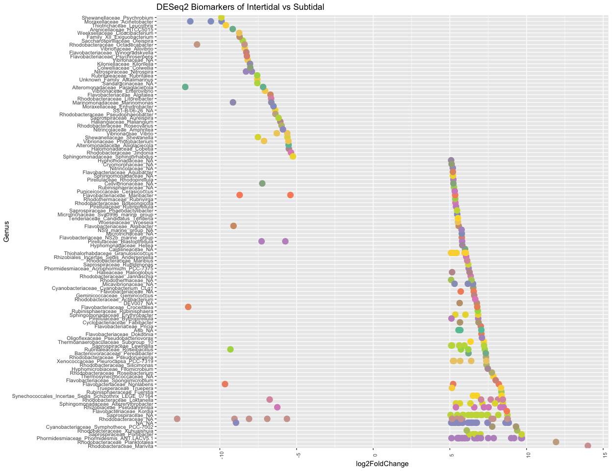

DADA\_Plastic\_Q6
================

### Meta-analysis

–\> compare with Frère et al.,
dataset

# Prepare tables

## What is the number of shared ASVs between the 2 dataset, whithout seawater?

``` r
library(UpSetR)
library(reshape2)

df <- cbind(samples = rownames(OTU_subset), OTU_subset)
df$condition <- meta$Dataset
df_m <- melt(df, id.vars=c("samples", "condition"))

mcast <- dcast(df_m, condition ~ variable, sum)
mcastt <- t(mcast)
colnames(mcastt) <- mcastt[1,]
mcastt <- mcastt[-1,]
mcastt <- as.data.frame(mcastt)
#colnames(mcastt) <- c("P_1", "FL_1", "AT_5", "AT_60", "POL")

write.table(mcastt, "mcastt.txt", sep="\t")
mcastt <- read.table("mcastt.txt", header=T, row.names=1)

mcastt[mcastt > 1] <- 1


# Using UpSetR


p2 <- upset(mcastt, 
               keep.order=T, 
               order.by = "freq")
```


# Proportion of specific ASVs in Frère et al. (2018) microplastic

``` r
# Using DESeq2 package

library(DESeq2)
library(phyloseq)
library(ggplot2)
library(reshape2)
library(RColorBrewer)


# ASVs present in laura dataset PP + PE

meta_l <- subset(meta, Dataset == "laura_dataset")
OTU_laura <- OTU_subset[rownames(OTU_subset) %in% rownames(meta_l),]
OTU_laura <- as.data.frame(t(OTU_laura))
OTU_laura <- OTU_laura[apply(OTU_laura[,], 1, function(x) !all(x==0)),]
OTU_laura$taxa <- rownames(OTU_laura)

# ASVs present present in microrevenge dataset

meta_m <- subset(meta, Dataset == "microrevenge")

OTU_microrevenge <- OTU_subset[rownames(OTU_subset) %in% rownames(meta_m),]
OTU_microrevenge <- as.data.frame(t(OTU_microrevenge))
OTU_microrevenge <- OTU_microrevenge[apply(OTU_microrevenge[,], 1, function(x) !all(x==0)),]
OTU_microrevenge$taxa <- rownames(OTU_microrevenge)


#ASVs present in polymers in both dataset


OTU_pol <- as.data.frame(t(OTU_subset))
OTU_pol <- OTU_pol[apply(OTU_pol[,], 1, function(x) !all(x==0)),]
OTU_pol$taxa <- rownames(OTU_pol)


#ASVs present in Laura dataset (in a total of 37778)

# Specific to Laura dataset
Spe_laura <- OTU_laura[!(rownames(OTU_laura) %in% rownames(OTU_microrevenge)),] # 20936 specific ASVs
Spe_Laura_pol <- Spe_laura[rownames(Spe_laura) %in% rownames(OTU_pol),]
#Spe_Laura_pol <- Spe_Laura_pol[!(rownames(Spe_Laura_pol) %in% rownames(OTU_sw)),]# 19285 ASVs present only on plastics

# Shared with microrevenge dataset
Shared_laura <- OTU_laura[rownames(OTU_laura) %in% rownames(OTU_microrevenge),] # 8162 ASVs

#ASVs present in microrevenge dataset 
Spe_micro <- OTU_microrevenge[!(rownames(OTU_microrevenge) %in% rownames(OTU_laura)),]


# ASVs present in laura dataset 

Spe_laura <- as.data.frame(Spe_laura)
Shared_laura <- as.data.frame(Shared_laura)

table_perc <- as.data.frame(otu_subset)

Syneccho <- data.frame(Specific_Laura = apply(table_perc[,colnames(table_perc) %in% Spe_laura$taxa], 1, sum),
                       Shared = apply(table_perc[,colnames(table_perc) %in% Shared_laura$taxa], 1, sum))


df <- cbind(samples = rownames(Syneccho), Syneccho)
df$Zone = meta[match(df$samples, rownames(meta)),"Date_collecte"]
df$Dataset = meta[match(df$samples, rownames(meta)),"Dataset"]
df_m <- melt(df, id.vars=c("samples","Zone","Dataset"))
df_m <- na.omit(df_m)


gg <- ggplot(subset(df_m, Dataset=="laura_dataset"), aes(x = samples, y = as.numeric(value), fill=variable)) +
  geom_bar(stat = "identity", position = "fill") +
  theme(strip.text.y = element_text(size = 10, angle = 0), axis.text.x = element_text(size = 8 , angle = 90), axis.text.y = element_text(size = 12), legend.position="right") +
  facet_grid(.~Zone, scales="free", space="free_x") +
  ggtitle("Specific and shared ASVs in PE.PP floating polymers")
```


# Proportion of specific ASVs in incubated microplastic

``` r
# Using DESeq2 package

library(DESeq2)
library(phyloseq)
library(ggplot2)
library(reshape2)
library(RColorBrewer)


# ASVs present in microrevenge dataset PP + PE

meta_spe <- subset(meta, Dataset == "microrevenge")
meta_spe$meta <- paste(meta_spe$Position_estran, meta_spe$Jour_.incubation,  sep="_")

otu.perc <- otu_subset[rownames(otu_subset) %in% rownames(meta_spe)]
otu.perc <- as.data.frame(t(otu.perc))
otu.perc <- otu.perc[apply(otu.perc[,], 1, function(x) !all(x==0)),]


Spe_micro <- as.data.frame(OTU_microrevenge)
Shared_laura <- as.data.frame(Shared_laura)

table_perc <- as.data.frame(t(otu.perc))

Syneccho <- data.frame(Specific_Microrevenge = apply(table_perc[,colnames(table_perc) %in% Spe_micro$taxa], 1, sum),
                       Shared = apply(table_perc[,colnames(table_perc) %in% Shared_laura$taxa], 1, sum))


df <- cbind(samples = rownames(Syneccho), Syneccho)
df$Zone = meta_spe[match(df$samples, rownames(meta_spe)),"meta"]
df_m <- melt(df, id.vars=c("samples","Zone"))
df_m <- na.omit(df_m)

#df_m$Zone <- factor(df_m$Zone, levels= c("BB_35","BB_63","BB_91","BB_140","BH_35","BH_63","BH_91","BH_140", "HB_7","HB_14","HB_42","HB_56","HB_70","HB_98","HB_147", "HH_7","HH_14","HH_42","HH_56","HH_70","HH_98","HH_147"))


gg <- ggplot(df_m, aes(x = samples, y = as.numeric(value), fill=variable)) +
  geom_bar(stat = "identity", position = "fill") +
  theme(strip.text.y = element_text(size = 10, angle = 0), axis.text.x = element_text(size = 8 , angle = 90), axis.text.y = element_text(size = 12), legend.position="right") +
  facet_grid(.~Zone, scales="free", space="free_x") +
  ggtitle("Specific and shared ASVs in PE.PP incubated polymers")
```


### NMDS of the two datasets

``` r
library(vegan)
library(ggplot2)


df <- as.matrix(otu_subset)
#jacc <- vegdist(OTU_subset, method="jaccard", binary=T)
#nmds <- metaMDS(jacc, wascore = F)
bray <- vegdist(df, method="bray")
nmds <- metaMDS(bray, wascore = F)


data.score <- as.data.frame(scores(nmds))
data.score$site <- rownames(data.score)

data.score$Emplacement <- meta$Position_estran
data.score$Incubation_time <- meta$Jour_.incubation
data.score$Polymer <- meta$Polymere_type
data.score$Dataset <- meta$Dataset

col.pal <- brewer.pal(8, "Set2")
col.pal = colorRampPalette(col.pal)(7)

p2 <- ggplot(data=data.score, aes(x=NMDS1, y=NMDS2, colour = Dataset)) +
  geom_point(data=data.score, aes(x=NMDS1, y=NMDS2, size=2)) +
  scale_colour_manual(values=col.pal) 
```


``` r
p2 <- ggplot(data=data.score, aes(x=NMDS1, y=NMDS2, colour = Emplacement)) +
  geom_point(data=data.score, aes(x=NMDS1, y=NMDS2, size=as.factor(Incubation_time),size=4) +
  scale_colour_manual(values=col.pal)) 
```


### Biomarkers of Laura/microrevenge dataset

``` r
# Using DESeq2 package

library(DESeq2)
library(phyloseq)
library(ggplot2)
library(reshape2)
library(RColorBrewer)


# Create a matrix good

OTU_micro <- OTU_subset[rownames(OTU_subset) %in% rownames(meta_m),]
OTU_micro <- as.data.frame(t(OTU_micro))
OTU_micro <- OTU_micro[apply(OTU_micro[,], 1, function(x) !all(x==0)),]


OTU_subset_l <- OTU_subset[rownames(OTU_subset) %in% rownames(meta_l),]
OTU_subset_l <- as.data.frame(t(OTU_subset_l))
OTU_subset_l <- OTU_subset_l[apply(OTU_subset_l[,], 1, function(x) !all(x==0)),]

OTU_subset_l_sub <- OTU_subset_l[rownames(OTU_subset_l) %in% rownames(OTU_micro),]
OTU_subset_l_sub <- OTU_subset_l_sub[apply(OTU_subset_l_sub[,], 1, function(x) !all(x==0)),]


OTU_ssingleton <- as.data.frame(t(OTU_subset))

OTU_ssingleton <- OTU_ssingleton[rownames(OTU_ssingleton) %in% rownames(Shared_laura),]
OTU_ssingleton <- OTU_ssingleton[apply(OTU_ssingleton[,], 1, function(x) !all(x==0)),]

OTU <- otu_table(OTU_ssingleton, taxa_are_rows= T)
#OTU$t <- rowSums(OTU_ssingleton)

#metadata <- read.csv("metadata_Meta_plastic.csv", header=T, row.names=1, sep=";")

#metadata$group <- factor(paste0(metadata$Position_estran, metadata$Polymere))
META <- sample_data(metadata)


Phymatrice <- phyloseq(OTU, META)

#Samples <- subset_samples(Phymatrice, Type_sample=="sample")
#Samples <- subset_samples(Samples, Matrice=="Polymere")

deseq = phyloseq_to_deseq2(Phymatrice, ~ Dataset)


gm_mean = function(x, na.rm=TRUE){ exp(sum(log(x[x > 0]), na.rm=na.rm) / length(x))}
geoMeans = apply(counts(deseq), 1, gm_mean)
deseq = estimateSizeFactors(deseq, geoMeans = geoMeans)

deseq <- DESeq(deseq)

resLFC <- lfcShrink(deseq, coef="Dataset_microrevenge_vs_laura_dataset", type="apeglm")
resSub <- subset(resLFC, padj < 0.01 & log2FoldChange > 5 | log2FoldChange < -5)


Sub.Data <- as.data.frame(resSub)
#Sub.Data <- Sub.Data[rownames(Sub.Data) %in% rownames(OTU_abund),]


Sub.Data <- cbind(taxa = rownames(Sub.Data), Sub.Data)
Sub <- Sub.Data[order(Sub.Data$log2FoldChange, decreasing=F),]
#Sub$taxa <- paste("OTU", Sub$taxa , sep="")
levels <- as.factor(Sub.Data$taxa)
Sub.Data$taxa <- factor(Sub.Data$taxa, levels=levels)

Sub.Data$Family = taxtable[match(Sub.Data$taxa, rownames(taxtable)),"taxa"]
Sub.Data$Genus = taxtable[match(Sub.Data$taxa, rownames(taxtable)),"taxa"]

x = tapply(Sub.Data$log2FoldChange, Sub.Data$Genus, function(x) max(x))
x = sort(x, TRUE)
Sub.Data$Genus = factor(as.character(Sub.Data$Genus), levels=names(x))

col.pal <- brewer.pal(8, "Set2")
col.pal = colorRampPalette(col.pal)(137)


gg <- ggplot(Sub.Data, aes(x=Genus, y = log2FoldChange, colour= Family)) + 
  #geom_bar(stat = "identity", position = "stack") +
  geom_point(size=4) +
  theme(strip.text.y = element_text(size = 10, angle = 0), axis.text.x = element_text(size = 8 , angle = 90), axis.text.y = element_text(size = 8), legend.position="none") +
  coord_flip() +
  scale_color_manual(values=col.pal) +
  ggtitle("DESeq2 Biomarkers of Intertidal vs Subtidal")
```


