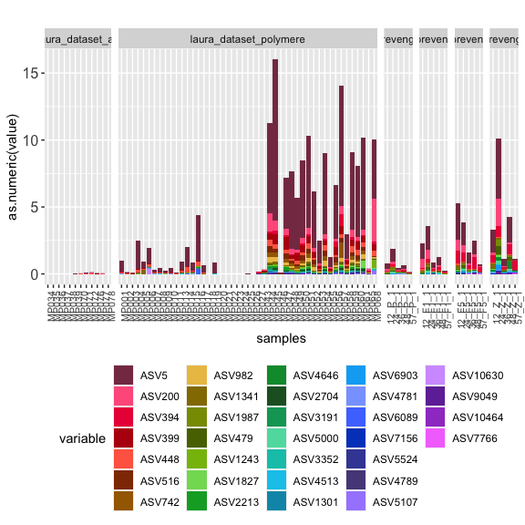
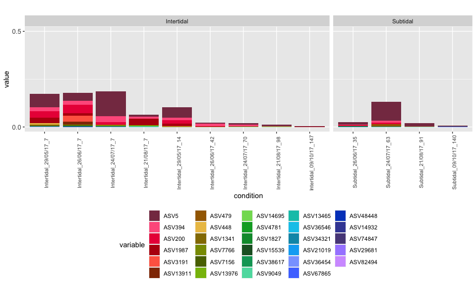
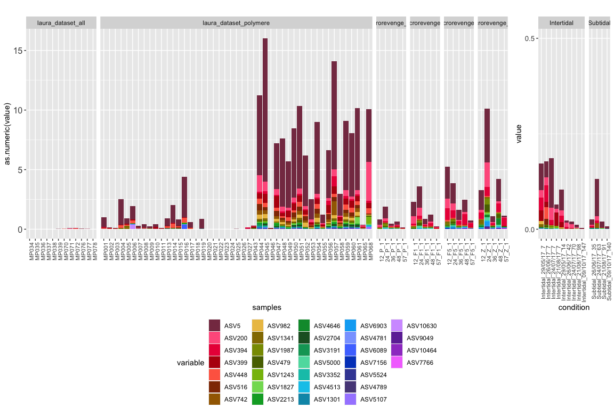

DADA2\_Plastic\_Q7
================

Vibrio dynamic in incubated plastics, floating microplastics and
seawater.

# Prepare tables

### Plot ASVs to the genus Vibrio

``` r
library(reshape2)
library(ggplot2)

otu.perc <- as.data.frame(t(OTU_subset))

otu.perc$tot <- rowSums(otu.perc)


otu.perc <- otu.perc[order(otu.perc$tot, decreasing=T),]
otu.perc <- otu.perc[c(1:10000),-332]
levels <- as.factor(rownames(otu.perc))


otu.perc <- as.data.frame(t(otu.perc))


df <- cbind(samples = rownames(otu.perc), otu.perc)
df$Matrice = meta[match(df$samples, rownames(meta)),"meta"]


df_m <- melt(df, id.vars=c("samples","Matrice"))
df_m <- na.omit(df_m)
df_m$Genus <- taxtable[match(df_m$variable, rownames(taxtable)),"Genus"]
df_m$family <- taxtable[match(df_m$variable, rownames(taxtable)),"Family"]

#col.pal <- brewer.pal(8, "Set2")
#col.pal = colorRampPalette(col.pal)(39)

#df_m_sub <- df_m[df_m$variable %in% Sub.late$taxa,]
df_m_sub <- subset(df_m, Genus == "Vibrio")

#df_m_sub_sub <- subset(df_m_sub, Z == "laura_dataset_unknown")

df_m_sub_sub <- subset(df_m_sub, Matrice == "laura_dataset_polymere" | Matrice == "laura_dataset_all" |  Matrice == "microrevenge_0.2"| Matrice == "microrevenge_1"| Matrice == "microrevenge_5"| Matrice == "microrevenge_60")

col.pal = c("#863951","#ff608c","#ea2046","#b7000f","#ff6851","#913503","#a36800","#ecc153","#947a00","#899900","#596f00","#87bc09","#81db61","#00a82e","#009738","#1f5f2c","#01a365","#5bdcae","#00c4b7","#00c8eb","#0097b6","#00adf4","#89a5ff","#4e79ff","#0247c4","#4049a3","#584988","#a78aff","#d39fff","#6f33a6","#9f44cb","#f479fe","#862e7f","#fbadee","#dfa0c4","#9e066e","#d7008f","#ffb0cc","#ff499a","#4facd8","#787ec7","#7461cf","#c25abe","#c46197")


gg <- ggplot(df_m_sub_sub, aes(x=samples, y = as.numeric(value), fill=variable)) +
  geom_bar(stat = "identity", position = "stack") +
  theme(strip.text.y = element_text(size = 10, angle = 0), axis.text.x = element_text(size = 8 , angle = 90), axis.text.y = element_text(size = 12), legend.position="bottom") +
  facet_grid(.~Matrice, scales="free", space="free_x") +
  #guides(fill=FALSE) +
  scale_fill_manual(values= col.pal) +
  #scale_y_continuous(limits = c(0,15), breaks=c(0,5,10,15)) +
  ggtitle("")
```



### Plot Vibrios in microrevenge

``` r
# Create a matrix table with Families

taxtable <- read.table("DADA2_Plastic_OTU_tax.txt", header=T, row.names=1, sep="\t")
taxtable <- as.data.frame(taxtable)

Vibrio <- subset(taxtable, Genus == "Vibrio")

# Create a matrix table with Families

OTU <- read.table("DADA2_Plastic_OTU_percent.txt", header=T, row.names=1)


colnames(OTU) <- gsub('X','', colnames(OTU))

#write.table(OTU, "DADA2_Plastic_OTU_percent.txt", sep = "\t")


metadata <- read.csv("metadata_Meta_plastic.csv", header=T, row.names=1, sep=";")
metadata <- metadata[ order(row.names(metadata)), ]
metadata$meta <- paste(metadata$Date_collecte, metadata$Jour_.incubation,  sep="_")

meta <- subset(metadata, Dataset == "microrevenge")
meta <- subset(meta, Type_sample == "sample")
meta <- subset(meta, Matrice == "Polymere")
#meta <- subset(meta, Zone == "Intertidal")
meta <- subset(meta, type_incubation != "longue_courte")
meta <- subset(meta, Polymere != "PVC")
OTU_subset <- OTU[,colnames(OTU) %in% rownames(meta)]
OTU_subset <- OTU_subset[apply(OTU_subset[,], 1, function(x) !all(x==0)),]
OTU_subset <- as.data.frame(t(OTU_subset))
#colnames(OTU_subset) <- paste("OTU", colnames(OTU_subset), sep="")

OTU_subset <- OTU_subset[ order(row.names(OTU_subset)), ]
meta <- meta[ order(row.names(meta)), ]

otu.perc <- OTU_subset[,colnames(OTU_subset) %in% rownames(Vibrio)]

meta$condition <- paste(meta$Zone, meta$Date_collecte, meta$Jour_.incubation,  sep="_")

otu.perc$condition = meta[match(rownames(otu.perc), rownames(meta)),"condition"]
otu.perc <- cbind(samples = rownames(otu.perc), otu.perc) 

df_m <- melt(otu.perc, id.vars=c("samples", "condition"))
mcast <- dcast(df_m, condition ~ variable, mean)
rownames(mcast) <- mcast$condition
mcast <- mcast[,-1]

otu.perc <- as.data.frame(t(mcast))

otu.perc$tot <- rowSums(otu.perc)


otu.perc <- otu.perc[order(otu.perc$tot, decreasing=T),]
otu.perc <- otu.perc[c(1:29),-14]
levels <- as.factor(rownames(otu.perc))


otu.perc <- as.data.frame(t(otu.perc))

#rownames(mcast) <- mcast$condition

#mcast <- mcast[,-1]

otu.perc$condition <- rownames(otu.perc)
mcast <- melt(otu.perc)
mcast <- as.data.frame(mcast)


#df <- cbind(samples = rownames(otu.perc), otu.perc)
mcast$Date_collecte = meta[match(mcast$condition, meta$condition),"Date_collecte"]
mcast$Zone = meta[match(mcast$condition, meta$condition),"Zone"]
mcast$position = meta[match(mcast$condition, meta$condition),"Emplacement"]
mcast$Time= meta[match(mcast$condition, meta$condition),"Jour_.incubation"]
#mcast$Genus = taxtable[match(mcast$variable, rownames(taxtable)),"taxa"]

#mcast$Genus <- ifelse(mcast$variable =="Other", "ZZZ_Other", as.character(mcast$Genus))
#mcast$Genus <- ifelse(is.na(mcast$Genus), "ZZ_Unknown", as.character(mcast$Genus))


# Keep the 20 most abundant families in the dataset

#df_m <- melt(df, id.vars=c("samples","Temps_incubation","Zone","pol","sd"))

mcast <- na.omit(mcast)


mcast$Time <- factor(mcast$Time, levels=c("7","14","42","70","98","147","35","63","91","140"))
mcast$condition <- factor(mcast$condition, levels=c("Intertidal_29/05/17_7","Intertidal_26/06/17_7","Intertidal_24/07/17_7","Intertidal_21/08/17_7","Intertidal_29/05/17_14","Intertidal_26/06/17_42","Intertidal_24/07/17_70","Intertidal_21/08/17_98","Intertidal_09/10/17_147","Subtidal_26/06/17_35","Subtidal_24/07/17_63","Subtidal_21/08/17_91","Subtidal_09/10/17_140"))


col.pal = c("#863951","#ff608c","#ea2046","#b7000f","#ff6851","#913503","#a36800","#ecc153","#947a00","#899900","#596f00","#87bc09","#81db61","#00a82e","#009738","#1f5f2c","#01a365","#5bdcae","#00c4b7","#00c8eb","#0097b6","#00adf4","#89a5ff","#4e79ff","#0247c4","#4049a3","#584988","#a78aff","#d39fff","#6f33a6","#9f44cb","#f479fe","#862e7f","#fbadee","#dfa0c4","#9e066e","#d7008f","#ffb0cc","#ff499a","#4facd8","#787ec7","#7461cf","#c25abe","#c46197")

g <- ggplot(mcast, aes(x=condition, y = value, fill=variable)) +
  geom_bar(stat = "identity", position = "stack") +
  theme(strip.text.y = element_text(size = 10, angle = 0), axis.text.x = element_text(size = 8 , angle = 90), axis.text.y = element_text(size = 10), legend.position="bottom") +
  facet_grid(.~Zone, scales="free", space="free_x") +
  scale_y_continuous(limits = c(0,0.5), breaks=c(0,0.5)) +
  scale_fill_manual(values= col.pal) +
  ggtitle("")
```



# Combine plots

``` r
library(ggpubr)


figure <- ggarrange(gg, g,
                    ncol = 2, nrow = 1,
                    widths = c(5,1),
                    align = "hv",
                    legend = "bottom",
                    common.legend = TRUE)
```


